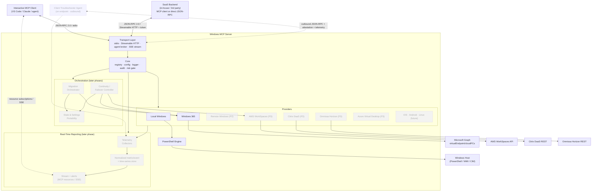
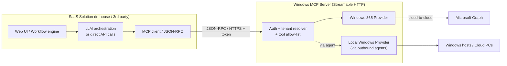
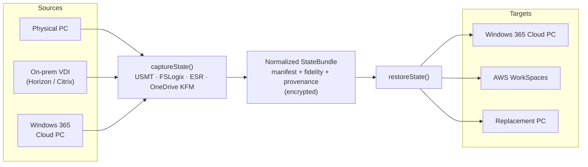
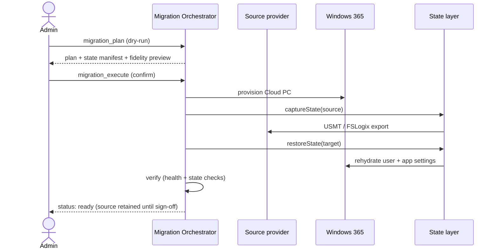
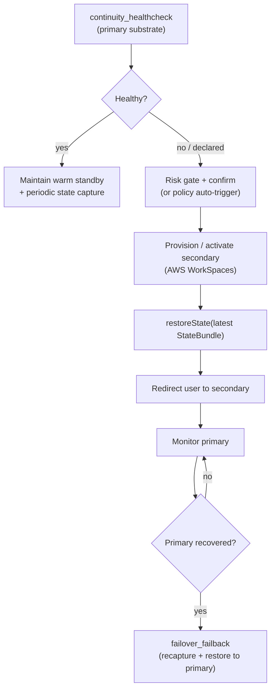
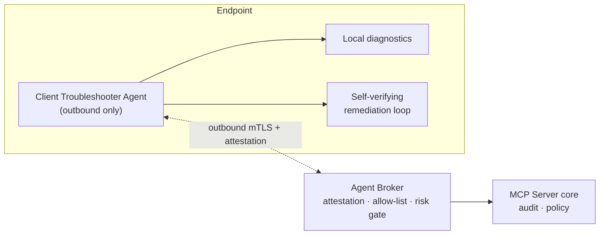
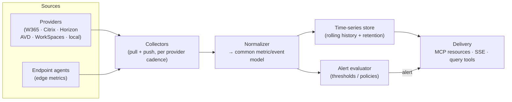
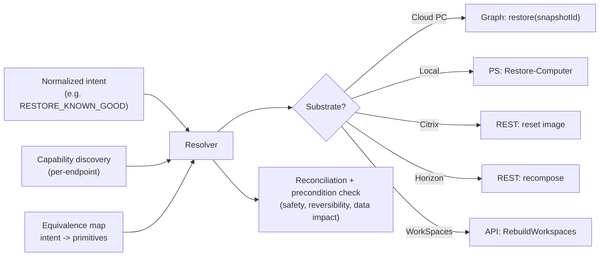
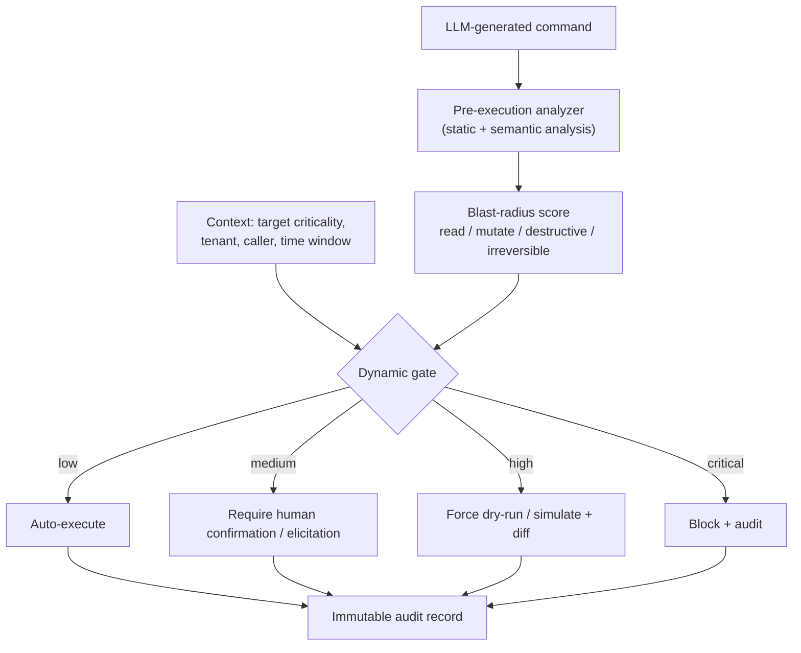

# Technical Specification — Windows, Cloud PC & Cross-Cloud Workspace MCP Server

| | |
|---|---|
| **Status** | Draft for review |
| **Version** | 0.2 (MVP core + strategic scope) |
| **Date** | 2026-06-08 |
| **Owner** | _TBD_ |
| **Reviewers** | _Team_ |
| **Audience** | Engineering, IT Operations, Security, Product, SaaS / Platform Integrators, Business Continuity / DR, End-User-Computing (EUC) & Migration Programs |

> **How to read this document.** Every chapter is framed with four lenses so the whole team — engineers, IT admins, security, and product — can find themselves in it:
> - **Why this chapter matters** — the purpose and stakes.
> - **What we're solving** — the concrete problem being addressed.
> - **Admin / management experience** — what the IT operator, helpdesk agent, or platform engineer sees and does.
> - **End-user experience** — what the employee whose device or Cloud PC is being managed feels, even though they never touch the server directly.

---

## Table of Contents

1. [Summary](#1-summary)
2. [Goals & Non-Goals](#2-goals--non-goals)
3. [Personas & Audiences](#3-personas--audiences)
4. [Use Cases](#4-use-cases)
5. [Technology Stack](#5-technology-stack)
6. [Architecture](#6-architecture)
7. [SaaS Backend Integration](#7-saas-backend-integration)
8. [Provider Model](#8-provider-model)
9. [Cloud Transformation, Failover & State Portability](#9-cloud-transformation-failover--state-portability)
10. [Client Troubleshooter Agent](#10-client-troubleshooter-agent)
11. [Real-Time Reporting & Telemetry](#11-real-time-reporting--telemetry)
12. [Transport & Hosting](#12-transport--hosting)
13. [Security Model](#13-security-model)
14. [API Surface — Tool Catalog](#14-api-surface--tool-catalog)
15. [Configuration](#15-configuration)
16. [Cross-Cutting Concerns](#16-cross-cutting-concerns)
17. [Roadmap & Phasing](#17-roadmap--phasing)
18. [Testing & Verification](#18-testing--verification)
19. [Risks & Open Questions](#19-risks--open-questions)
20. [Appendices](#20-appendices)

---

## 1. Summary

A production-ready **Model Context Protocol (MCP) server** that exposes Windows and cloud-desktop **management, migration, cross-cloud continuity**, maintenance, and troubleshooting to MCP-compatible AI clients (VS Code, Claude Desktop, custom agents) **and to in-house or third-party SaaS backends** that connect over the Streamable HTTP transport.

It delivers six classes of capability:

1. **Local / host Windows management** — arbitrary PowerShell execution, WMI/CIM queries, service and process control, event-log inspection, disk and network diagnostics, and Windows Update operations.
2. **Windows 365 Cloud PC fleet management** — list, inspect, reboot, reprovision, restore, resize, rename, and troubleshoot Cloud PCs via Microsoft Graph.
3. **Multi-platform VDI / DaaS management** — **full lifecycle management** of virtual-desktop estates across **Citrix (DaaS / Virtual Apps & Desktops)**, **Omnissa Horizon (formerly VMware Horizon)**, **Azure Virtual Desktop (AVD)**, and **AWS WorkSpaces**: machine catalogs / desktop pools / delivery groups, machine power and maintenance, live session control (disconnect, log-off, shadow, message), and image rollout.
4. **Cloud transformation & migration** — move a user from a *traditional* desktop (physical PC, or on-prem virtualization / VDI such as Omnissa Horizon, Citrix, or Hyper-V) to a *cloud* desktop (Windows 365 Cloud PC), carrying their user, application, and settings state across.
5. **Cross-cloud continuity & failover** — fail a user's cloud workspace over from one substrate to another (e.g. **Azure / Windows 365 → AWS WorkSpaces**, or Citrix ↔ Horizon) for disaster recovery or capacity events, then fail back, rehydrating their state on the target.
6. **Real-time reporting & telemetry** — a **live, unified observability layer** across every substrate: streaming session and machine state, resource and logon metrics, fleet-health snapshots, and threshold alerts, delivered through MCP resource subscriptions and a streaming endpoint. **This is a first-class capability, not an afterthought.**

A **client-side troubleshooting agent** runs on the endpoint to perform local diagnostics, guided or autonomous self-verifying remediation, and edge telemetry/state capture, brokered safely back to the server.

Capabilities 3–6 are unified by two cross-cutting layers: a **substrate-agnostic user-state & settings portability layer** (capture/restore a "known-good" set of user, application, and OS settings identically across physical, VDI, DaaS, and cloud substrates) and a **normalized real-time telemetry layer** (one metric and event model across all substrates).

It is built on an **extensible provider architecture** so additional substrates plug in without core changes: Remote Windows (WinRM/SSH), **Citrix**, **Omnissa Horizon**, **Azure Virtual Desktop**, and **AWS WorkSpaces** are on the roadmap (with room for more — Amazon AppStream, Parallels RAS, Nerdio, and others), and — as a deliberate forward path — **non-Windows endpoints (iOS, Android, Linux)** managed through their native control planes.

It supports two consumption models: **interactive** (a human admin driving an AI client) and **programmatic** (a SaaS backend calling tools as a remote management API, with or without its own LLM). [Chapter 7](#7-saas-backend-integration) details the SaaS integration topology, multi-tenancy, and trust model; [Chapter 9](#9-cloud-transformation-failover--state-portability) covers migration, failover, and state portability; [Chapter 10](#10-client-troubleshooter-agent) covers the client troubleshooter agent; [Chapter 11](#11-real-time-reporting--telemetry) covers real-time reporting.

**Why this chapter matters.** It sets a shared mental model before the details. If a reader stops here, they should still understand what the server is and who it helps: it manages Windows *wherever it runs*, and it moves users — and their state — *between* those places safely.

**What we're solving.** Desktops are fragmented across physical machines, on-prem VDI (Citrix, Omnissa Horizon), and multiple clouds (Windows 365, AVD, AWS WorkSpaces), and troubleshooting them is scattered across RDP sessions, the Citrix and Horizon consoles, the Intune portal, the Windows 365 portal, the AWS and Azure consoles, ad-hoc PowerShell, and tribal knowledge. There is no single, real-time view of the whole estate, no unified way to *manage* every desktop platform, no auditable way to *move* a user (and their settings) from a traditional desktop to the cloud, and no way to *fail them over* to a different substrate when their primary one degrades. This server unifies management, migration, continuity, and **live reporting** behind one consistent, automatable, auditable interface that an AI assistant can drive in natural language.

**Admin / management experience.** Instead of switching between consoles, an admin asks an AI assistant ("why is this Cloud PC slow?", "disconnect this user's Citrix session and restart their VDA", "show me live logon times across the Horizon pool", "migrate this user to a Cloud PC and bring their settings", "fail this team over to AWS WorkSpaces") and the assistant calls vetted tools on this server — with real-time data behind every answer.

**End-user experience.** Employees get faster resolutions, less downtime, and — crucially — *continuity*: when they are moved to a new Cloud PC or failed over to another substrate, their files, app configuration, and personal settings come with them, so the new desktop feels like the one they left.

---

## 2. Goals & Non-Goals

### MVP Goals
- Ship an MVP that manages **local Windows** and **Windows 365 Cloud PCs**.
- Support **both** MCP transports: `stdio` (local) and **Streamable HTTP** (remote / multi-client).
- Provide a clean provider abstraction for future platforms.
- Enforce a defensible security model around arbitrary command execution.
- Full audit logging, timeouts, and graceful lifecycle management suitable for production.

### Strategic / North-Star Goals (post-MVP, designed-for now)
These ship in later phases ([Chapter 17](#17-roadmap--phasing)) but shape the architecture today so the design does not paint itself into a corner:
- **Multi-platform VDI / DaaS management:** **full lifecycle management** across **Citrix**, **Omnissa Horizon**, **Azure Virtual Desktop**, and **AWS WorkSpaces** — inventory, machine power/maintenance, live session control (disconnect/log-off/shadow/message), and image rollout — with headroom for further platforms (Amazon AppStream, Parallels RAS, Nerdio, …).
- **Real-time reporting & telemetry:** a **first-class**, normalized, live observability layer across every substrate — streaming session/machine state, resource & logon metrics, fleet-health snapshots, and alerts.
- **Cloud transformation:** migrate users from traditional desktops / on-prem VDI (Citrix, Horizon) to **Windows 365 Cloud PCs**, transferring user, application, and settings state.
- **Cross-cloud continuity:** **fail a user's cloud workspace over between substrates** (e.g. Azure / Windows 365 ↔ AWS WorkSpaces, or Citrix ↔ Horizon) for DR and capacity events, with fail-back.
- **State & settings portability:** a **substrate-agnostic** capture/restore layer for user, application, and OS settings — the common foundation beneath migration and failover.
- **Client troubleshooter agent:** an outbound endpoint agent for local diagnostics, guided/autonomous self-verifying remediation, and edge telemetry/state capture.
- **Beyond Windows:** a path to manage **iOS, Android, and Linux** endpoints through their native control planes as additional providers.

### Non-Goals (MVP)
- Remote Windows management (Phase 2 — interface stubbed only).
- VDI / DaaS providers — Citrix, Omnissa Horizon, Azure Virtual Desktop, AWS WorkSpaces (Phase 3).
- Real-time reporting & telemetry pipeline (later phase — P-Report; point-in-time inventory/status is available from MVP via `*_list` / `*_get`).
- Cloud transformation, cross-cloud failover, and the state-portability layer (later phases — designed for, not shipped at MVP).
- The client troubleshooter agent (later phase; depends on the outbound-agent topology).
- Non-Windows (iOS / Android / Linux) providers (exploratory, later phase).
- A custom UI / dashboard — consumption is through MCP clients (which may render the live telemetry feed).
- Agent / LLM orchestration logic — explicitly out of MCP's scope.

**Why this chapter matters.** Clear boundaries prevent scope creep and set reviewer expectations about what "done" means for the MVP — while naming the strategic goals (multi-platform management, real-time reporting, migration, continuity) the design must not foreclose.

**What we're solving.** Ambiguity about scope is the most common reason infrastructure projects stall. This chapter is the contract: a tight MVP, plus an explicit north star (full VDI/DaaS management, real-time reporting, migration, continuity, portability) that the provider, telemetry, and state abstractions are built to reach.

**Admin / management experience.** Admins know exactly which surfaces are covered on day one (local + Cloud PC) and which — Citrix/Horizon/AVD/WorkSpaces management, real-time reporting, migration, cross-cloud failover, the client agent — are coming, so they can plan runbooks, DR strategy, and monitoring accordingly.

**End-user experience.** Users benefit first where the pain is greatest — Cloud PC and local-machine issues — and are assured that future continuity features (move-with-state, cross-cloud failover) are designed in from the start, not bolted on.

---

## 3. Personas & Audiences

This server has a critical distinction: **the people who operate it are not the people who benefit from it most directly** — and, increasingly, one "operator" is not a person at all but an automated client-side agent.

| Persona | Role | Relationship to the server |
|---|---|---|
| **Platform Engineer** | Builds/deploys the server, writes runbooks | Configures, secures, and extends it |
| **IT Admin / SysAdmin** | Day-to-day fleet operations | Drives it through an AI client |
| **VDI / DaaS Platform Admin** | Runs Citrix / Horizon / AVD / WorkSpaces estates | Manages pools, catalogs, sessions, images, and power across platforms through one interface |
| **NOC / Reporting Analyst** | Watches fleet health & SLAs in real time | Consumes the live telemetry feed, fleet snapshots, and alerts ([Chapter 11](#11-real-time-reporting--telemetry)) |
| **Helpdesk / L1–L2 Support** | First responder to tickets | Uses guided AI workflows backed by the server |
| **EUC / Migration Lead** | Owns desktop-to-cloud transformation programs | Plans and runs traditional→cloud migrations through the server's migration tools |
| **Business Continuity / DR Owner** | Owns RTO/RPO targets and failover strategy | Defines continuity policy; initiates and oversees cross-cloud failover / fail-back |
| **Security / Compliance** | Governs access and audit | Reviews audit logs, owns the threat model |
| **SaaS / Integration Developer** | Builds an in-house or 3rd-party product on top of the server | Connects a SaaS backend to the server over HTTP and calls tools programmatically |
| **Client Troubleshooter Agent** _(automated)_ | Software agent running on the endpoint — the first **non-human** operator | Runs local diagnostics and self-verifying remediation, brokered back to the server ([Chapter 10](#10-client-troubleshooter-agent)) |
| **End User (Employee)** | Uses a Windows PC or Cloud PC (and, later, a Mac / mobile / Linux endpoint) | Never touches the server; benefits from faster, safer support **and from continuity** — their state follows them across migrations and failovers |

**Why this chapter matters.** Throughout the spec, "admin experience" and "end-user experience" mean two different people. Naming them up front — including the new automated agent operator — keeps the rest of the document unambiguous.

**What we're solving.** Tools that conflate "operator" and "beneficiary" tend to optimize for the wrong person. We explicitly design the operator experience (admin, integration, or agent) to produce a better outcome for the beneficiary (end user).

**Admin / management experience.** Admins, helpdesk, migration leads, and DR owners get a single capable interface that meets them where they already work (their editor / AI client), spanning day-to-day fixes, migrations, and failover.

**End-user experience.** Employees experience the *result* — quicker fixes, fewer reboots, less data loss during reprovision/restore, and a desktop that *follows them* when they are migrated or failed over — without learning anything new.

---

## 4. Use Cases

Concrete scenarios showing the server in action. Each lists the **trigger**, the **tools** involved, the **admin experience**, and the **end-user benefit**.

### UC-1 — "My Cloud PC is frozen"
- **Trigger:** Employee reports an unresponsive Windows 365 Cloud PC.
- **Tools:** `cloudpc_list` → `cloudpc_get` → `cloudpc_reboot`.
- **Admin experience:** Asks the assistant to find the user's Cloud PC and reboot it; confirms the destructive-op prompt. No portal navigation.
- **End-user benefit:** Back to work in ~1–2 minutes instead of a long ticket queue.

### UC-2 — Corrupted profile / broken Cloud PC
- **Trigger:** Repeated sign-in failures or a corrupted OS image.
- **Tools:** `cloudpc_get` → `cloudpc_restore` (from snapshot) or `cloudpc_reprovision`.
- **Admin experience:** Reviews snapshots, restores to a known-good point with an explicit `confirm`. Dry-run first to preview impact.
- **End-user benefit:** A clean machine without manual rebuild; restore preserves the most recent safe state.

### UC-3 — Local service won't start (e.g., print spooler)
- **Trigger:** Printing broken on a kiosk / shared host running the server.
- **Tools:** `service_list` → `service_control(restart)` → `eventlog_query`.
- **Admin experience:** Restarts the service and pulls the related event-log entries in one conversation to confirm root cause.
- **End-user benefit:** Printing restored without a desk visit.

### UC-4 — "Why is this machine slow?"
- **Trigger:** Performance complaint.
- **Tools:** `system_info` → `process_list(top)` → `disk_info` → `wmi_query`.
- **Admin experience:** Gets a consolidated health snapshot (CPU/mem hogs, disk pressure, uptime) and decides whether to `process_kill` a runaway process.
- **End-user benefit:** Targeted fix rather than a blanket "reboot and hope."

### UC-5 — Right-sizing an under-powered Cloud PC
- **Trigger:** Developer needs more vCPU/RAM.
- **Tools:** `cloudpc_get` → `cloudpc_resize`.
- **Admin experience:** Resizes to the approved SKU after a `confirm`; no separate licensing console juggling.
- **End-user benefit:** A faster machine without reprovisioning or data loss.

### UC-6 — Patch / update verification
- **Trigger:** Security mandates a patch baseline.
- **Tools:** `windows_update(scan)` → `windows_update(install, confirm)` → `eventlog_query`.
- **Admin experience:** Scans, reports pending updates, installs within a maintenance window with explicit confirmation.
- **End-user benefit:** Stays compliant and secure with minimal disruption.

### UC-7 — Guided diagnostics for L1 support
- **Trigger:** Generic "it's broken" ticket.
- **Tools:** `diagnostics_run(check)` (DISM/SFC/connectivity) → `network_info`.
- **Admin experience:** L1 follows an AI-guided flow that runs vetted troubleshooters and summarizes results, escalating only when needed.
- **End-user benefit:** Faster first-contact resolution; fewer escalations.

### UC-8 — Fleet triage at scale
- **Trigger:** Region-wide complaint after a change.
- **Tools:** `cloudpc_list(filter)` → bulk `cloudpc_troubleshoot` / `cloudpc_reboot`.
- **Admin experience:** Lists affected Cloud PCs by property filter and runs the Graph `troubleshoot` action across them.
- **End-user benefit:** Issues fixed proactively, often before users notice.

### UC-9 — Embedded in a SaaS helpdesk product
- **Trigger:** A third-party ITSM / helpdesk SaaS wants to offer "Restart Cloud PC" and "Run diagnostics" actions inside its own ticket UI.
- **Tools:** `cloudpc_*` and read-only local tools, invoked programmatically by the SaaS backend over Streamable HTTP.
- **Admin experience:** The SaaS exposes vetted, allow-listed actions as buttons / workflows; the MCP server is the execution engine behind them. No portal hopping; actions are audited centrally.
- **End-user benefit:** Self-service or one-click remediation directly inside the tool employees already use to raise tickets.

### UC-10 — "Lift me to the cloud" (traditional desktop / VDI → Cloud PC)
- **Trigger:** A user on an aging physical laptop or on-prem VDI desktop is being transformed to Windows 365.
- **Tools:** `state_capture` (source) → `cloudpc_provision` → `migration_execute` → `state_restore` (target) → `migration_status`.
- **Admin experience:** Runs a **dry-run migration plan**, reviews exactly what state will move (user profile, app settings, known-folder/OneDrive data, browser, Wi-Fi, printers), then executes with `confirm`; progress is polled to completion.
- **End-user benefit:** Signs into a new Cloud PC that already has their files, app configuration, and personal settings — none of the "first day on a blank machine" friction.

### UC-11 — Cross-cloud failover (Azure / Windows 365 → AWS WorkSpaces)
- **Trigger:** A Windows 365 regional incident (or capacity crunch) makes Cloud PCs unavailable; the DR owner declares failover.
- **Tools:** `continuity_healthcheck` → `failover_initiate(target=awsworkspaces)` → `state_restore` → `failover_status`; later `failover_failback` once Azure recovers.
- **Admin experience:** Confirms the high-impact failover (or it fires from policy); the continuity controller provisions/activates WorkSpaces, rehydrates the latest captured state, and redirects users — then fails back cleanly when the primary is healthy.
- **End-user benefit:** Keeps working on an equivalent desktop in another cloud, with their settings intact, instead of waiting out the outage.

### UC-12 — Restore user & app settings onto a replacement machine
- **Trigger:** Hardware failure, loss/theft, or reprovision; the user receives a new or rebuilt machine.
- **Tools:** `state_list` → `state_restore(target)` / `settings_import`.
- **Admin experience:** Picks the most recent **known-good** state snapshot and restores user/app settings onto the replacement (Cloud PC *or* physical) with `confirm`.
- **End-user benefit:** Their environment — app settings, preferences, mapped drives/printers — is back without manual reconfiguration.

### UC-13 — Client troubleshooter agent self-heals an endpoint
- **Trigger:** An endpoint reports recurring faults (failed service, disk pressure, broken connectivity) — often before the user notices.
- **Tools:** `agent_diagnostics` → risk-gated `agent_remediate` (self-verifying loop) → `agent_collect_state` on escalation.
- **Admin experience:** The agent runs a vetted diagnose→fix→**re-measure** loop and **auto-rolls-back** if the symptom didn't improve; only unresolved cases escalate to a human, with a state bundle already attached.
- **End-user benefit:** Many issues fixed silently and safely on-device — fewer tickets, less downtime.

### UC-14 — Full session management across Citrix / Horizon
- **Trigger:** A user's published-desktop session is hung, or an admin must drain a VDA / pool machine for maintenance.
- **Tools:** `citrix_session_list` / `horizon_session_list` → `*_session_disconnect` / `*_session_logoff` / `*_session_message` → `*_machine_maintenance(on)` → `*_machine_power(restart)`.
- **Admin experience:** Finds the live session by user across **either** platform, messages the user, logs them off gracefully, puts the machine in maintenance, and restarts the VDA — without opening Citrix Studio or the Horizon console.
- **End-user benefit:** A wedged session is cleared in seconds, with a heads-up message, instead of a long ticket.

### UC-15 — Real-time fleet health & SLA reporting
- **Trigger:** A NOC analyst needs a live view of logon times, session counts, and resource pressure across Windows 365, Citrix, Horizon, AVD, and WorkSpaces.
- **Tools:** `report_snapshot` (unified fleet status) → `report_subscribe` (live stream of metrics/state changes) → `session_monitor` for a hotspot.
- **Admin experience:** Subscribes once and watches a **single normalized feed** — registration state, average logon duration, protocol latency, CPU/memory/GPU pressure — update in real time across every platform; drills into any machine or session.
- **End-user benefit:** Degradations are spotted and fixed before users feel them; SLA breaches are caught proactively, not in retrospect.

### UC-16 — Alert-driven proactive triage
- **Trigger:** Logon duration on a delivery group crosses a threshold, or a pool's registered-machine count drops.
- **Tools:** `alert_define` (threshold) → push `notifications/resources/updated` → `report_query` (root-cause metrics) → platform remediation tool.
- **Admin experience:** Defines thresholds once; the server **pushes an alert** the moment one trips, with the offending machines/sessions already identified, and the assistant proposes the matching fix.
- **End-user benefit:** Issues are intercepted at the first sign of trouble, often before a single ticket is raised.

**Why this chapter matters.** Use cases turn an abstract capability list into outcomes stakeholders can recognize and prioritize.

**What we're solving.** It connects each tool to a real scenario — the highest-volume support tickets (UC-1–UC-9), the strategic migration/continuity workflows (UC-10–UC-13), and **full multi-platform management plus real-time reporting** (UC-14–UC-16) — proving both the MVP scope and the north-star direction are grounded in concrete outcomes.

**Admin / management experience.** Demonstrates the "one conversation, many consoles collapsed" workflow that defines the product's value.

**End-user experience.** Every scenario ends in a measurable user benefit: less downtime, no data loss, faster resolution.

---

## 5. Technology Stack

| Concern | Choice | Rationale |
|---|---|---|
| Language / runtime | **TypeScript / Node.js (LTS)** | Team preference; strong async I/O; first-class MCP + Graph + cloud SDKs |
| MCP SDK | **`@modelcontextprotocol/sdk` v1.x** | Production-recommended line (v2 is pre-alpha until ~Q3 2026) |
| Schema validation | **`zod`** | Tool input schemas + config validation |
| Microsoft Graph | **`@microsoft/microsoft-graph-client`** + **`@azure/identity`** | Official Windows 365 management path |
| AWS WorkSpaces | **`@aws-sdk/client-workspaces`** + **`@aws-sdk/credential-providers`** | WorkSpaces provider + cross-cloud failover target (Phase 3 / continuity) |
| Citrix | **Citrix DaaS REST APIs** + **Citrix Cloud / CVAD** (typed client over `undici`/`axios`) | Full Citrix DaaS & Virtual Apps and Desktops management (Phase 3) |
| Omnissa Horizon | **Omnissa Horizon Server REST API** (typed client) | Full Horizon pod/pool/session/image management (Phase 3) |
| Azure Virtual Desktop | **`@azure/arm-desktopvirtualization`** + Graph | AVD host pools / session hosts / user sessions (Phase 3) |
| HTTP transport | **`express`** + SDK `StreamableHTTPServerTransport` | Standard, well-supported |
| Real-time telemetry & streaming | **SSE** (Streamable HTTP) + MCP **resource subscriptions** + **`ws`** (agent channel); pluggable time-series store (e.g. Prometheus-compatible / SQLite→external) | Live, normalized metrics/events across substrates (P-Report); return-then-stream, not poll-only |
| Logging | **`pino`** | Structured, fast, production-grade |
| Config | **`dotenv`** + zod | 12-factor friendly |
| State & settings portability | Orchestrates **USMT**, **FSLogix**, **OneDrive Known Folder Move**, **Enterprise State Roaming** | We *drive* proven native state tooling — we don't reinvent capture/restore (later phase) |
| Client agent | Same TS/Node core, packaged as an **outbound agent** | One codebase; dials out to the broker over the HTTP/WebSocket channel; also streams edge telemetry (later phase) |
| Long-running jobs | In-process async job + status polling (pluggable store later) | Migration/failover are long-running; return-then-poll model |
| Beyond Windows (future) | iOS/Android via **Intune / Graph (MDM)**; Linux via the **SSH provider** | Native control plane per OS; exploratory |
| Testing | **`vitest`** | Fast, TS-native |
| Tooling | `typescript`, `tsx`, `eslint` | Build, run, lint |

**Why this chapter matters.** Stack choices drive hireability, maintainability, and long-term support cost.

**What we're solving.** Avoiding native build chains (e.g., node-gyp for WMI) and betting on the *stable* SDK line de-risks delivery. Reusing official platform SDKs/REST APIs (Graph, AWS, Citrix DaaS, Omnissa Horizon, AVD ARM) plus proven native state tooling (USMT/FSLogix) keeps multi-platform management, migration, and failover on supported rails rather than bespoke, fragile mechanisms; real-time reporting rides MCP's own subscription/streaming primitives instead of a separate bus.

**Admin / management experience.** A pure-TypeScript server is easy to deploy (Node runtime), inspect, and extend without specialized toolchains.

**End-user experience.** Indirect but real: a maintainable stack means faster feature delivery and fewer regressions affecting their machines.

---

## 6. Architecture



The same core serves an interactive client, a SaaS backend, and (later) outbound **client agents**; only the transport and auth differ. Two cross-cutting subsystems sit beside the providers: the **orchestration layer** (migration, continuity, state portability) *composes* provider operations, and the **reporting layer** *observes* them — collecting normalized telemetry from every provider and the agents, then streaming it to clients. Neither couples a provider to migration, failover, or reporting logic. See [Chapter 7](#7-saas-backend-integration) for the SaaS topology, [Chapter 9](#9-cloud-transformation-failover--state-portability) for orchestration, [Chapter 10](#10-client-troubleshooter-agent) for the agent, and [Chapter 11](#11-real-time-reporting--telemetry) for reporting.

### Proposed directory layout

```
src/
  index.ts                      # entry: CLI/transport selection, lifecycle
  server.ts                     # McpServer + provider registry + aggregation
  config/
    schema.ts                   # zod config schema
    config.ts                   # load + validate env/file
  core/
    logger.ts                   # pino setup
    audit.ts                    # per-call audit trail
    errors.ts                   # typed error -> MCP error mapping
    powershell.ts               # arbitrary PS execution engine
    riskGate.ts                 # risk-aware execution gate (later phase)
  transports/
    stdio.ts
    http.ts                     # Express + auth + Host validation
    agentBroker.ts              # outbound-agent broker channel (later phase)
  orchestration/                # later phases (P-Migrate / P-Failover)
    jobs.ts                     # async long-running job + status polling
    migrationOrchestrator.ts    # traditional -> cloud transformation
    continuityController.ts     # cross-cloud failover / fail-back
  state/                        # later phase (P-State)
    statePortability.ts         # substrate-agnostic capture/restore facade
    capture.ts                  # USMT / FSLogix / settings export drivers
    restore.ts                  # rehydrate onto target substrate
  reporting/                    # later phase (P-Report)
    collector.ts                # pull/push telemetry from providers + agents
    metrics.ts                  # normalized metric/event model
    store.ts                    # pluggable time-series store
    stream.ts                   # SSE + MCP resource subscriptions
    alerts.ts                   # thresholds + alert evaluation
  providers/
    provider.ts                 # IPlatformProvider + registry
    local/
      localProvider.ts
      wmi.ts                    # CIM/WQL helper
      tools.ts
    windows365/
      cloudPcProvider.ts
      graphClient.ts            # app-only + delegated auth
      tools.ts
    remoteWindows/              # P2: WinRM / SSH
    awsWorkspaces/              # P3: @aws-sdk/client-workspaces
    citrix/                     # P3: Citrix DaaS / CVAD REST
    horizon/                    # P3: Omnissa Horizon REST
    avd/                        # P3: Azure Virtual Desktop (ARM + Graph)
    nonWindows/                 # future: iOS / Android / Linux
agent/                          # later phase: client troubleshooter agent (outbound)
  agent.ts                      # enroll, attest, dial broker
  diagnostics.ts                # local checks
  remediation.ts                # self-verifying fix loop
  telemetry.ts                  # stream edge metrics to the collector
test/
.vscode/mcp.json                # sample client wiring
```

**Why this chapter matters.** The architecture is the blueprint every engineer codes against; the layered design keeps transport, core, and platform logic independently testable.

**What we're solving.** Separation of concerns so a change in one transport or provider can't destabilize the rest — and so the orchestration layer can compose providers (for migration/failover) without coupling the core to any substrate.

**Admin / management experience.** Clear layering makes operational reasoning simple: transport issues, core issues, and provider issues are diagnosed independently.

**End-user experience.** A resilient design means fewer outages of the management plane that supports their devices.

---

## 7. SaaS Backend Integration

Because MCP is an open, transport-agnostic protocol (JSON-RPC 2.0) and this server ships the **Streamable HTTP** transport, an in-house or third-party **SaaS backend can connect to it as a client** — driving tools through its own LLM orchestration, or calling them purely programmatically as a remote management API (no LLM required).

### 7.1 Integration patterns

| Pattern | How it works | Best for |
|---|---|---|
| **A — SaaS as MCP client** | The SaaS backend opens an MCP session over Streamable HTTP and calls tools (with its own LLM or directly) | A 3rd-party / in-house product adding Windows + Cloud PC management features |
| **B — Embedded server** | The SaaS deploys this server as a microservice / sidecar inside its own infrastructure | An in-house platform you control end-to-end |
| **C — Programmatic (no LLM)** | The SaaS calls tools as a typed remote API for automation, runbooks, and workflows | ITSM integrations, workflow engines, scheduled jobs |

### 7.2 Topology



### 7.3 Multi-tenancy
- **Multi-tenant Microsoft Entra app:** each customer grants admin consent in their own tenant; the server requests Graph tokens per tenant rather than holding per-customer secrets.
- **Per-tenant credential resolution:** the server maps an authenticated request → tenant → Graph credentials/token. In multi-tenant mode there is no shared global Graph client.
- **Isolation:** audit logs, rate limits, and quotas are partitioned per tenant; no cross-tenant token or data bleed.

### 7.4 Authentication & authorization
- **MVP:** a static bearer token per integration — sufficient for a single trusted SaaS or an internal platform.
- **SaaS-grade:** **OAuth 2.1** per the MCP authorization spec — scoped, expiring, per-tenant tokens; optional **mTLS** for backend-to-backend trust. See the security model ([Chapter 13](#13-security-model)).

### 7.5 Tool exposure (allow-listing)
- Each integration credential is bound to an explicit **allow-list** of tools.
- The default posture for **third-party** integrations **excludes** arbitrary-execution tools (`powershell_run`, `process_kill`, `service_control`) and exposes curated Cloud PC + read-only diagnostics.
- **In-house** integrations may opt into the full catalog under their own governance and audit. (Security details: Chapter 13.4.)

### 7.6 The local-host reach problem (agent topology)
- The **Windows 365 provider is cloud-to-cloud** — a SaaS reaches it directly through Microsoft Graph with no host locality, so it works as a SaaS integration today.
- The **local provider runs on a host**, so a cloud SaaS cannot reach thousands of customer machines inbound. The pattern is an **outbound agent**: the server runs on/near each host and dials out to a central broker. This pairs with the Remote Windows (WinRM/SSH) work in Phase 2 and ships under the **P-SaaS** track (Chapter 17), and is realized end-to-end by the client troubleshooter agent ([Chapter 10](#10-client-troubleshooter-agent)).

### 7.7 MVP vs SaaS-grade

| Concern | MVP today | SaaS-grade (P-SaaS) |
|---|---|---|
| Multi-tenancy | Single Graph app / single `.env` | Multi-tenant Entra app + per-tenant resolution |
| Authentication | Static bearer token | OAuth 2.1, scoped per-tenant tokens |
| Tool exposure | All tools enabled | Per-integration allow-list |
| Audit / isolation | Single audit log | Per-tenant segregation + quotas / rate limits |
| Local-host reach | Host-local only | Outbound agent fleet |
| Scaling | Single process | Stateless horizontal scaling + session store |

**Why this chapter matters.** It answers a direct stakeholder question — *can we build on, or sell into, a SaaS with this?* — and draws a clear line between what works at MVP (single-tenant) and what SaaS-grade multi-tenancy requires.

**What we're solving.** Turning a single-operator tool into an **embeddable management engine** other products can build on, without weakening the security model.

**Admin / management experience.** Operators (yours or the SaaS vendor's) get the same vetted tools surfaced inside whatever product they prefer; governance stays centralized through per-integration allow-lists and per-tenant audit.

**End-user experience.** Employees get one-click or fully automated remediation **inside the products they already use** (ITSM portal, helpdesk app) — regardless of which system ultimately fulfills the request.

---

## 8. Provider Model

The core defines a single contract; every platform implements it and contributes tools to a registry the server aggregates at startup.

```ts
interface IPlatformProvider {
  readonly id: string;                 // e.g. "local", "windows365", "awsworkspaces"
  readonly displayName: string;
  isAvailable(): Promise<boolean>;     // env/credentials present?
  registerTools(server: McpServer): void;
  dispose?(): Promise<void>;

  // --- Optional capabilities the orchestration layer discovers at runtime ---
  // Declares which normalized operations this substrate supports.
  capabilities?(): ProviderCapabilities;
  // Lifecycle primitives used by migration / failover (substrate-specific under the hood).
  provision?(spec: ProvisionSpec): Promise<EndpointRef>;
  health?(ref: EndpointRef): Promise<HealthStatus>;
  // Substrate-agnostic user / app / settings state.
  captureState?(ref: EndpointRef, scope: StateScope): Promise<StateBundleRef>;
  restoreState?(ref: EndpointRef, bundle: StateBundleRef): Promise<RestoreResult>;

  // --- Full VDI / DaaS management (Citrix, Horizon, AVD, WorkSpaces) ---
  listGroupings?(): Promise<Grouping[]>;          // catalogs / desktop pools / delivery groups / host pools
  listMachines?(filter?: MachineFilter): Promise<Machine[]>;
  listSessions?(filter?: SessionFilter): Promise<Session[]>;
  controlSession?(ref: SessionRef, action: SessionAction): Promise<Result>; // disconnect | logoff | message | shadow | reset
  powerMachine?(ref: MachineRef, action: PowerAction): Promise<Result>;     // start | stop | restart | suspend | resume
  setMaintenance?(ref: MachineRef, on: boolean): Promise<Result>;
  rolloutImage?(ref: GroupingRef, image: ImageSpec): Promise<JobRef>;       // recompose / push-image / catalog update
  assignUser?(ref: GroupingRef, user: UserRef, on: boolean): Promise<Result>;

  // --- Real-time telemetry (Chapter 11) ---
  // Point-in-time metrics for this provider's estate.
  getMetrics?(scope?: MetricScope): Promise<MetricSample[]>;
  // Live stream: push normalized samples/events to the collector until disposed.
  streamTelemetry?(sink: TelemetrySink, scope?: MetricScope): Promise<Subscription>;
}

// What a provider advertises so the resolver can map a normalized intent onto it.
interface ProviderCapabilities {
  substrate: "physical" | "vdi" | "daas" | "cloud";
  operations: NormalizedOp[];          // e.g. PROVISION, RESTORE_KNOWN_GOOD, RESIZE, CAPTURE_STATE,
                                       //      SESSION_CONTROL, POWER, MAINTENANCE, IMAGE_ROLLOUT
  canBeMigrationSource: boolean;
  canBeMigrationTarget: boolean;
  canBeFailoverTarget: boolean;
  // Reporting: which metric/event kinds this provider can emit, and whether it can stream live.
  telemetry?: { metrics: MetricKind[]; events: EventKind[]; live: boolean };
}
```

Adding a platform = implement `IPlatformProvider`, register it. No core changes. Providers implement only the methods their substrate supports: a **VDI / DaaS** provider (Citrix, Horizon, AVD, WorkSpaces) implements the session/machine/image methods; providers that participate in **migration or failover** implement the lifecycle + state methods; providers that feed **real-time reporting** implement `getMetrics` / `streamTelemetry`. The orchestration ([Chapter 9](#9-cloud-transformation-failover--state-portability)) and reporting ([Chapter 11](#11-real-time-reporting--telemetry)) layers **discover these at runtime** via `capabilities()` and never hard-code substrate specifics. A limited provider (e.g. a future iOS/Android one) can implement only the base methods plus a narrow `capabilities()` and still participate as a first-class management target.

**Why this chapter matters.** This abstraction is what turns a "Windows tool" into an "any-managed-endpoint-anywhere platform" without rewrites — and it is the seam the management, migration, failover, state-portability, and reporting layers all build on.

**What we're solving.** The broader ask — **fully manage** endpoints across local hosts, Windows 365, **Citrix, Omnissa Horizon, Azure Virtual Desktop, AWS WorkSpaces**, and later iOS/Android/Linux; *move users and their state between them*; and *report on all of it in real time* — without coupling the core or the cross-cutting layers to any one platform.

**Admin / management experience.** New platforms appear as new tools in the same AI client; the workflow never changes as coverage grows, and migration/failover/reporting automatically light up for any provider that advertises the matching capabilities.

**End-user experience.** Whatever flavor of desktop an employee runs (physical, Cloud PC, VDI, or another cloud), support and continuity are unified — consistent quality of service, and a desktop that follows them across substrates.

---

## 9. Cloud Transformation, Failover & State Portability

Three strategic capabilities share one engine: a **substrate-agnostic state layer** (*what* moves) plus an **orchestration layer** (*how* it moves) that composes the provider primitives from [Chapter 8](#8-provider-model). State portability is the foundation; migration and failover are two orchestrations built on top of it. All three are **later-phase** (P-State / P-Migrate / P-Failover, [Chapter 17](#17-roadmap--phasing)) but are designed for now so the MVP abstractions don't have to be re-cut later.

> **Honest constraint up front.** State fidelity across *heterogeneous* substrates is never 100%. The layer's job is to capture the maximum supported state, **record exactly what did and didn't transfer** (a fidelity manifest), and degrade gracefully — not to promise a perfect clone.

### 9.1 State & settings portability (the foundation)

A normalized capture/restore layer for the three tiers of "what makes a desktop *theirs*":

| Tier | Examples | Primary mechanism (driven, not reinvented) |
|---|---|---|
| **User data** | Documents, desktop, known folders | OneDrive Known Folder Move; USMT; FSLogix |
| **Application settings** | Per-app config, browser profiles, mapped drives, printers | USMT custom XML; app-specific exporters |
| **OS / user settings** | Personalization, accessibility, language, Wi-Fi profiles | Enterprise State Roaming; USMT; settings export |

Capture and restore are the provider methods `captureState()` / `restoreState()` ([Chapter 8](#8-provider-model)). The layer selects the best mechanism per substrate and emits a normalized **StateBundle** — a manifest describing *what* was captured, its **fidelity** (`full` / `partial` / `referenced`), and provenance — encrypted at rest and in transit. Tools: `state_capture`, `state_restore`, `state_list`, `settings_export`, `settings_import` ([Chapter 14](#14-api-surface--tool-catalog)).



### 9.2 Cloud transformation & migration (traditional → cloud)

Moving a user from a physical PC or on-prem VDI (Citrix, Omnissa Horizon) to a Windows 365 Cloud PC is, today, a manual multi-tool affair that frequently loses user state. The **migration orchestrator** composes it into one audited, resumable operation: **plan (dry-run) → provision target → capture source → restore onto target → cut over → verify**, keeping the source intact until the target is verified (reversibility). Tools: `migration_plan`, `migration_execute`, `migration_status`.



### 9.3 Cross-cloud continuity & failover (Azure ↔ AWS WorkSpaces)

A single cloud is a single point of failure: a regional outage or capacity event on Windows 365 can idle a whole team. The **continuity controller** monitors primary health and, on a manual or policy trigger, **provisions/activates a secondary substrate** (e.g. AWS WorkSpaces, or another DaaS such as Citrix / Horizon), **restores the latest StateBundle**, and **redirects** users — then **fails back** when the primary recovers. Tools: `continuity_healthcheck`, `failover_initiate`, `failover_status`, `failover_failback`.

Key design points:
- **RTO/RPO are driven by capture cadence** — more frequent `state_capture` ⇒ smaller data loss on failover.
- **Warm vs cold standby:** pre-staged WorkSpaces/desktops (faster, costlier) vs on-demand provisioning (cheaper, slower).
- **Health is informed by real-time telemetry** — the continuity controller consumes the same live signals as [Chapter 11](#11-real-time-reporting--telemetry), so failover can trip on observed degradation, not just hard outages.
- **Failover is high-impact** → it is risk-scored and `confirm`-gated (or policy-triggered with a full audit trail).
- **Caveats made explicit:** data sovereignty/residency, cross-cloud licensing, and image/app parity between substrates must be validated before relying on failover.



**Why this chapter matters.** Management keeps a desktop running; **transformation and continuity keep the *user* running** — across a migration to the cloud or a failover between clouds. This is where the product moves from "fix my machine" to "my workspace is durable and portable."

**What we're solving.** There is no single, auditable way to (a) move a user and their state from a traditional desktop to the cloud, or (b) fail a user over to a different cloud when their primary degrades. The state layer plus orchestration provide both, reusing each provider's native primitives.

**Admin / management experience.** One conversation drives a previously multi-day, multi-tool project: dry-run a migration and see exactly what state will transfer; declare a failover and watch users land on an equivalent cloud desktop — all gated, audited, and reversible.

**End-user experience.** Their desktop *follows them*. After a migration to a Cloud PC, or a failover to AWS WorkSpaces, their files, app configuration, and personal settings are there — the new machine feels like the one they left, and downtime shrinks from days/hours to minutes.

---

## 10. Client Troubleshooter Agent

The local provider runs *on a host*, so a central server or cloud SaaS cannot reach thousands of endpoints inbound (the reach problem in [Chapter 7](#7-saas-backend-integration)). The **client troubleshooter agent** is the answer: a lightweight, **outbound-only** agent — the same TS/Node core, repackaged — that runs on the endpoint, **dials out** to the broker, **attests** its identity, and then performs **local diagnostics and self-verifying remediation** under policy. It is also the on-device **state-capture executor** for migration and failover at the edge. (Later phase: **P-Agent**, [Chapter 17](#17-roadmap--phasing).)



### 10.1 Autonomy levels
The agent never acts beyond a **policy ceiling** set per tenant/endpoint; the risk gate ([Chapter 13](#13-security-model)) governs each action.

| Level | Behavior | Gate |
|---|---|---|
| **L0 — Observe** | Collect diagnostics / state only | None (read-only) |
| **L1 — Suggest** | Propose a fix for a human to run | Human review |
| **L2 — Confirm** | Execute after explicit human confirmation | `confirm` + risk gate |
| **L3 — Autonomous** | diagnose → **checkpoint** → remediate → **re-measure** → **auto-rollback if not improved** | Risk gate + policy ceiling + immutable audit |

### 10.2 Why on-device
- **Reach:** an outbound dial avoids inbound exposure of every machine.
- **Resilience:** local diagnostics and cached remediations work through poor or offline connectivity.
- **Edge state capture:** the agent is where `state_capture` actually runs for migration/failover.
- **Safety:** the L3 loop is **self-verifying** — it checkpoints first and **reverts itself** if the symptom doesn't improve, rather than leaving a half-applied change.

Tools: `agent_list`, `agent_diagnostics`, `agent_remediate`, `agent_collect_state` ([Chapter 14](#14-api-surface--tool-catalog)).

> **Forward path (non-Windows).** The same outbound-agent abstraction extends naturally to **Linux** (native agent) and a constrained **macOS** variant. **iOS / Android** are different — they are managed through MDM (Intune / Graph), not a general on-device agent — so their provider exposes a deliberately narrower capability set ([Chapter 8](#8-provider-model)).

**Why this chapter matters.** It closes the one gap a cloud or central server can't otherwise close — reaching the endpoint itself — and does so without turning every machine into an inbound attack surface.

**What we're solving.** Inbound reach to fleets is unsafe and often impossible; an outbound, attested agent gives on-device diagnostics and *safe* autonomous remediation, plus the edge execution point for state capture.

**Admin / management experience.** Admins set an autonomy ceiling and an allow-list; the agent then resolves routine issues silently and only escalates the unresolved ones — with a diagnostic/state bundle already attached.

**End-user experience.** Many problems are fixed on-device before they're noticed, safely (self-verifying, auto-rollback), so users see fewer tickets, less downtime, and no risky half-applied changes.

---

## 11. Real-Time Reporting & Telemetry

Real-time reporting is a **first-class capability**, not a dashboard bolted on at the end. Every provider and every endpoint agent emits into one **normalized telemetry layer**, so an operator sees a single live view of the whole estate — Windows 365, Citrix, Omnissa Horizon, AVD, AWS WorkSpaces, and local/remote Windows — instead of stitching together five consoles after the fact. It is a **later-phase** track (**P-Report**, [Chapter 17](#17-roadmap--phasing)); point-in-time status is available from MVP via the `*_list` / `*_get` tools, while live streaming, history, and alerting land with the pipeline.

> **Why "real-time" matters here.** Desktop problems are time-sensitive — a logon storm, a degrading pool, a saturated host. Polling a portal every few minutes misses them. The whole point of this layer is to **push** state and metrics the moment they change, so the assistant (and the continuity controller in [Chapter 9](#9-cloud-transformation-failover--state-portability)) can act on *now*, not on a stale snapshot.

### 11.1 Normalized telemetry model

Every substrate reports different native counters; the layer maps them onto one model so a query or alert is written **once** and works **everywhere**:

| Dimension | Examples (normalized) |
|---|---|
| **Entity** | substrate · grouping (pool/catalog/delivery-group/host-pool) · machine · session · user |
| **State** | machine registration/power state · session connect/disconnect/active/idle · maintenance flag |
| **Metrics** | CPU / memory / disk / GPU · logon duration · protocol latency & round-trip (ICA / Blast / RDP) · session count · capacity / load index |
| **Events** | state transitions · errors · threshold breaches · lifecycle (provision/restore/migrate/failover) |

Providers advertise what they can emit via `capabilities().telemetry` ([Chapter 8](#8-provider-model)); the layer degrades gracefully when a substrate can't supply a given metric (it's marked *unavailable*, never faked).

### 11.2 Pipeline



- **Collectors** pull on a per-provider cadence (respecting each API's rate limits) and accept **push** from agents for low-latency edge metrics.
- **Normalizer** maps native counters to the common model and tags provenance + freshness.
- **Store** keeps rolling history for trends and post-incident review; retention is configurable and per-tenant.
- **Alert evaluator** runs thresholds/policies continuously and emits events the instant one trips.

### 11.3 Delivery — how clients get "real-time"

Reporting rides MCP's own primitives plus the Streamable HTTP transport, so no separate bus or portal is required:

1. **Live subscriptions** — telemetry is exposed as MCP **resources**; a client `resources/subscribe`s and receives `notifications/resources/updated` as state/metrics change.
2. **Streaming** — high-frequency feeds stream over **SSE** on the HTTP transport ([Chapter 12](#12-transport--hosting)) for live dashboards.
3. **Point-in-time & history** — `report_snapshot`, `report_query`, and `session_monitor` answer "what is it *now*" and "what was it over time."
4. **Push alerts** — `alert_define` registers a threshold; breaches arrive as resource-update notifications with the offending entities already identified.

Tools: `report_snapshot`, `report_query`, `report_subscribe`, `report_unsubscribe`, `session_monitor`, `alert_define`, `alert_list`, `alert_ack` ([Chapter 14](#14-api-surface--tool-catalog)).

### 11.4 Unified fleet view

Because the model is normalized, a single `report_snapshot` answers cross-substrate questions an admin otherwise can't ask in one place: *"across all platforms, which delivery groups / pools have logon duration over 30 s, and how many sessions are affected right now?"* The same feed backs SLA dashboards, capacity planning, and the health signal the continuity controller uses to decide on failover.

**Why this chapter matters.** "You can't manage what you can't see." Full management across many platforms is only credible if the operator has a **single, live, trustworthy** view — the user called this out as key, and the architecture treats it as a peer of management itself.

**What we're solving.** Fleet visibility today is fragmented across each platform's own console with its own refresh, metrics, and lag. This layer collapses them into one normalized, real-time feed an AI assistant can query and react to.

**Admin / management experience.** One subscription replaces tab-hopping across Citrix Director, the Horizon console, the Windows 365 and AVD portals, and the AWS console; alerts find the admin instead of the admin hunting dashboards.

**End-user experience.** Degradations are detected and fixed before they're felt — the user's session is healthy because the slow host was spotted and drained while they were still working.

---

## 12. Transport & Hosting

| Transport | Use case | Notes |
|---|---|---|
| **stdio** | Local, single client (VS Code / Claude Desktop) | Default; lowest overhead |
| **Streamable HTTP** | Remote / multi-client | Express host; **bearer-token auth required**; binds to `127.0.0.1` by default; Host-header validation to prevent DNS-rebinding |
| **SSE telemetry stream** | Live reporting feeds | Server-Sent Events on the HTTP host; carries real-time telemetry + alerts to subscribed clients ([Chapter 11](#11-real-time-reporting--telemetry)); auth + per-tenant scoping enforced |
| **Agent broker (outbound)** | Endpoint agents dialing in | Outbound-only from each endpoint; **mTLS + attestation**; per-agent allow-list & risk gate; later phase (P-Agent, [Chapter 10](#10-client-troubleshooter-agent)) |

Selection via CLI/env: `--transport stdio|http` (default `stdio`). HTTP exposes a `/health` endpoint, the MCP endpoint (`/mcp`), and — when reporting is enabled — the telemetry stream. The SSE stream and agent broker are additive channels on the HTTP host, not replacements.

**Why this chapter matters.** Transport determines who can reach the server and how it's secured — directly tied to the threat model.

**What we're solving.** Several deployment shapes: a personal local assistant (stdio), a shared team service (HTTP), a **SaaS-facing endpoint** (Streamable HTTP, [Chapter 7](#7-saas-backend-integration)), a **live reporting feed** (SSE, [Chapter 11](#11-real-time-reporting--telemetry)), and — later — an **outbound agent broker** that endpoint troubleshooter agents dial into ([Chapter 10](#10-client-troubleshooter-agent)).

**Admin / management experience.** An individual admin runs it locally with zero network exposure; a team can host it centrally behind auth for shared helpdesk use and live dashboards; at scale, agents reach endpoints without inbound exposure.

**End-user experience.** Centralized hosting means any authorized agent can help any user quickly, regardless of which admin picks up the ticket — and the outbound agent reaches their device even behind NAT/firewalls.

---

## 13. Security Model

> The team chose to allow **arbitrary PowerShell**. This maximizes capability but makes the server a high-value target. The following controls are **mandatory**, not optional.

### 13.1 Threat model
The primary risk is **remote code execution**: arbitrary PowerShell reachable over a network port equals full host compromise. The HTTP transport is the main attack surface. Later phases add more surfaces — the **outbound agent** on every endpoint, the **state-portability data** moving between substrates, **multiple platform credentials** (Citrix, Horizon, AVD, AWS), and the **live telemetry stream** — addressed in [13.5](#135-continuity-state--agent-considerations) and [13.6](#136-multi-platform--reporting-considerations).

### 13.2 Controls

| Control | Requirement |
|---|---|
| **Network binding** | HTTP binds to `127.0.0.1` by default; binding to `0.0.0.0` requires explicit opt-in config |
| **Authentication** | HTTP requires a bearer token (`Authorization: Bearer ...`); requests without it -> `401`. stdio inherits OS process trust |
| **Host-header validation** | Reject unexpected Host headers (anti DNS-rebinding) |
| **Command construction** | Scripts passed via `-EncodedCommand`/stdin — never string-concatenated into a shell line |
| **Timeouts** | Every PS invocation has a hard timeout with **process-tree kill** on expiry |
| **Audit logging** | Every tool call logged: tool, arguments (redaction-aware), caller/session, start/end, exit status, duration |
| **Destructive-op gating** | State-changing operations (reprovision, restore, service stop, process kill, reboot, **migration, failover**) honor a `confirm` flag / dry-run mode |
| **Risk-aware execution gate** | Model-/agent-generated commands are pre-scored for blast radius; disposition (run / confirm / dry-run / block) adapts to context (see [Appendix D.4](#d4-candidate-2--risk-aware-execution-gate-for-llm-generated-commands)) |
| **State-data protection** | StateBundles (user/app/settings, potentially PII) encrypted in transit and at rest; minimal retention; scoped per tenant |
| **Cross-cloud credentials** | Azure (Graph) and AWS credentials live in separate scoped secrets; least-privilege per cloud; never logged; no shared blast radius |
| **Per-platform credentials** | Citrix, Horizon, AVD, and AWS credentials are isolated, least-privilege, separately rotatable; one platform's compromise must not expose the others |
| **Session-control privilege** | Live session actions (disconnect, log-off, **shadow**, reset) are gated; **shadowing is consent/policy-bound and always audited** (a user's screen is involved) |
| **Telemetry data protection** | Live/stored telemetry can contain user, session, and machine identifiers (PII); minimize, scope per tenant, encrypt in transit (stream) and at rest (history), retention-bound |
| **Streaming authorization** | SSE/subscription feeds enforce the same auth + per-tenant scoping as tools; a subscriber only receives telemetry for entities it is entitled to |
| **Failover authorization** | Cross-substrate failover / fail-back is high-impact: risk-scored, `confirm`-gated or signed-policy-triggered, fully audited |
| **Agent trust** | Endpoint agents are outbound-only, **attested**, mTLS-authenticated, bound to a per-agent tool allow-list + autonomy ceiling; agent build supply-chain integrity is in scope |
| **Secret handling** | Graph/AWS/Citrix/Horizon/AVD credentials and HTTP token come from env/secret store; never logged; `.env` git-ignored |
| **Least privilege (Graph)** | App registration scoped to minimal permissions (e.g. `CloudPC.ReadWrite.All`) |
| **Per-integration tool allow-list** | Each SaaS / integration credential is scoped to an explicit subset of tools (e.g. expose `cloudpc_*` but withhold `powershell_run`) |
| **Tenant isolation** | Multi-tenant deployments resolve credentials and audit per tenant; no cross-tenant data or token bleed |

### 13.3 Open security decisions
- **HTTP auth mechanism:** static bearer token (MVP, recommended) vs full OAuth per MCP spec (later) vs mTLS.

### 13.4 SaaS / multi-tenant considerations
- **Exposing arbitrary PowerShell to a third party is a high-trust decision.** For external SaaS integrations, default to an allow-list that **excludes** `powershell_run` and other arbitrary-execution tools unless the customer explicitly opts in under contract.
- **Authentication for SaaS** should graduate from static bearer (MVP) to **OAuth 2.1** (per the MCP authorization spec) with per-tenant, scoped, expiring tokens.
- **Tenant credential resolution:** a multi-tenant Microsoft Entra app with per-customer admin consent; the server resolves the correct Graph credentials from the authenticated request context.
- **Quotas & rate limiting** per integration to prevent a noisy or compromised tenant from impacting others.

### 13.5 Continuity, state & agent considerations
- **State is sensitive.** A StateBundle can contain documents, credentials-adjacent settings, and PII. Treat it as crown-jewel data: encrypt, minimize, scope per tenant, and set short retention.
- **Failover is privileged.** Initiating or redirecting users across substrates is among the highest-impact operations; require explicit authorization (confirm or signed policy) and record an immutable audit entry.
- **Many platforms, many blast radii.** Holding Azure, AWS, Citrix, Horizon, and AVD credentials concentrates risk; keep them in separate scoped secrets with least privilege and independent rotation.
- **The agent is new attack surface.** An on-endpoint agent plus an autonomous remediation loop must be outbound-only, attested, allow-listed, autonomy-capped, and risk-gated; the agent's build/supply chain is part of the threat model.

### 13.6 Multi-platform & reporting considerations
- **Session shadowing is privacy-sensitive.** Viewing or controlling a live user session must be consent- or policy-bound, time-boxed, and always audited; treat it as a distinct, higher-trust permission than disconnect/log-off.
- **Telemetry is PII-adjacent.** Usernames, device names, and session details flow through the reporting layer; minimize fields, scope per tenant, and apply retention limits to stored history.
- **Stream entitlements.** A reporting subscriber must only receive telemetry for entities within its tenant/allow-list scope; the stream is authorized exactly like the tool surface.
- **Per-platform least privilege.** Each VDI/DaaS integration uses the narrowest role its API offers (e.g. read + session-control without image-rollout where rollout isn't needed).

**Why this chapter matters.** Arbitrary command execution is powerful and dangerous; security is what makes "full PowerShell" — and, later, autonomous agents, cross-substrate state movement, live session control, and a real-time telemetry stream — responsible features instead of liabilities.

**What we're solving.** Preventing the management plane from becoming an attack vector while preserving the capability the team asked for.

**Admin / management experience.** Guardrails are invisible in the happy path but enforce confirmation on destructive actions and produce a complete audit trail for every operation.

**End-user experience.** Strong protection of the management plane means employees' machines and data aren't exposed through a compromised admin tool; destructive-op gating prevents accidental data loss on *their* devices.

---

## 14. API Surface — Tool Catalog

All tools return MCP `content` arrays (typically JSON-as-text). Inputs are zod-validated. The same catalog is the **programmatic management API** a SaaS backend calls over Streamable HTTP ([Chapter 7](#7-saas-backend-integration)).

### 14.1 Local Windows provider

| Tool | Purpose | Key inputs | Mutating |
|---|---|---|---|
| `powershell_run` | Execute arbitrary PowerShell | `script`, `timeoutMs?`, `workingDir?` | ⚠️ Yes |
| `wmi_query` | Query WMI/CIM | `className` or `wql`, `namespace?`, `filter?` | No |
| `system_info` | OS/hardware summary | — | No |
| `service_list` | Enumerate services | `filter?`, `status?` | No |
| `service_control` | Start/stop/restart a service | `name`, `action`, `confirm` | Yes |
| `process_list` | List processes | `filter?`, `top?` | No |
| `process_kill` | Terminate a process | `pidOrName`, `confirm` | Yes |
| `eventlog_query` | Query event logs | `logName`, `level?`, `since?`, `max?` | No |
| `disk_info` | Volumes, free space, SMART summary | — | No |
| `network_info` | Adapters, IP, routes, connectivity tests | `target?` | No |
| `windows_update` | List / scan / install updates | `action`, `confirm` | Yes (install) |
| `diagnostics_run` | Curated troubleshooters (DISM/SFC/etc.) | `check`, `confirm` | Varies |

### 14.2 Windows 365 Cloud PC provider

Backed by Microsoft Graph `.../deviceManagement/virtualEndpoint/cloudPCs`.

| Tool | Graph action | Key inputs | Mutating |
|---|---|---|---|
| `cloudpc_list` | List Cloud PCs | `filter?`, `top?` | No |
| `cloudpc_get` | Get one | `cloudPcId` | No |
| `cloudpc_provision` | Provision a Cloud PC (migration target) | `spec`, `confirm` | Yes |
| `cloudpc_reboot` | Reboot | `cloudPcId`, `confirm` | Yes |
| `cloudpc_reprovision` | Reprovision | `cloudPcId`, `confirm` | Yes (destructive) |
| `cloudpc_restore` | Restore from snapshot | `cloudPcId`, `snapshotId`, `confirm` | Yes (destructive) |
| `cloudpc_resize` | Change vCPU/storage SKU | `cloudPcId`, `targetSku`, `confirm` | Yes |
| `cloudpc_rename` | Rename | `cloudPcId`, `displayName` | Yes |
| `cloudpc_troubleshoot` | Run troubleshoot | `cloudPcId` | Yes |
| `cloudpc_end_grace_period` | End grace period | `cloudPcId`, `confirm` | Yes |

### 14.3 Citrix provider (Phase 3 — full management)

Backed by the **Citrix DaaS / Citrix Cloud REST APIs** (and CVAD for on-prem). Full lifecycle management of a Citrix estate.

| Tool | Purpose | Key inputs | Mutating |
|---|---|---|---|
| `citrix_deliverygroup_list` | List delivery groups | `filter?` | No |
| `citrix_catalog_list` | List machine catalogs | `filter?` | No |
| `citrix_machine_list` | List machines (VDAs) + registration/load | `grouping?`, `filter?` | No |
| `citrix_machine_get` | Machine detail | `machineId` | No |
| `citrix_machine_power` | Power action | `machineId`, `action` (start/stop/restart/suspend/resume), `confirm` | Yes |
| `citrix_machine_maintenance` | Toggle maintenance mode | `machineId`, `on`, `confirm` | Yes |
| `citrix_session_list` | List sessions (by group/user) | `grouping?`, `user?` | No |
| `citrix_session_disconnect` | Disconnect a session | `sessionId`, `confirm` | Yes |
| `citrix_session_logoff` | Log off a session | `sessionId`, `confirm` | Yes |
| `citrix_session_message` | Send a message to a session | `sessionId`, `text` | Yes |
| `citrix_session_shadow` | Start a shadow/remote-assist session | `sessionId`, `confirm` | ⚠️ Yes (privileged, consent-gated) |
| `citrix_image_rollout` | Roll out a master image to a catalog | `catalogId`, `image`, `confirm` | Yes (job) |
| `citrix_assign_user` | Assign / unassign a user | `deliveryGroupId`, `user`, `on`, `confirm` | Yes |

### 14.4 Omnissa Horizon provider (Phase 3 — full management)

Backed by the **Omnissa Horizon Server REST API** (formerly VMware Horizon). Full lifecycle management of pods, pools, farms, sessions, and images.

| Tool | Purpose | Key inputs | Mutating |
|---|---|---|---|
| `horizon_pod_list` | List pods (Cloud Pod federation) | — | No |
| `horizon_pool_list` | List desktop pools | `filter?` | No |
| `horizon_farm_list` | List RDS farms | `filter?` | No |
| `horizon_machine_list` | List machines | `pool?`, `filter?` | No |
| `horizon_machine_get` | Machine detail | `machineId` | No |
| `horizon_machine_power` | Power action | `machineId`, `action`, `confirm` | Yes |
| `horizon_machine_maintenance` | Toggle maintenance mode | `machineId`, `on`, `confirm` | Yes |
| `horizon_session_list` | List sessions (by pool/user) | `pool?`, `user?` | No |
| `horizon_session_disconnect` | Disconnect a session | `sessionId`, `confirm` | Yes |
| `horizon_session_logoff` | Log off a session | `sessionId`, `confirm` | Yes |
| `horizon_session_reset` | Reset a session / machine | `sessionId`, `confirm` | Yes (destructive) |
| `horizon_session_message` | Send a message to a session | `sessionId`, `text` | Yes |
| `horizon_image_push` | Push image / recompose a pool | `poolId`, `image`, `confirm` | Yes (job) |
| `horizon_assign_user` | Assign / unassign a user | `poolId`, `user`, `on`, `confirm` | Yes |

### 14.5 Azure Virtual Desktop provider (Phase 3 — full management)

Backed by **Azure ARM (`@azure/arm-desktopvirtualization`)** + Graph. Host pools, session hosts, and user sessions.

| Tool | Purpose | Key inputs | Mutating |
|---|---|---|---|
| `avd_hostpool_list` | List host pools | `filter?` | No |
| `avd_sessionhost_list` | List session hosts | `hostPoolId` | No |
| `avd_sessionhost_get` | Session-host detail + status | `hostPoolId`, `name` | No |
| `avd_sessionhost_drain` | Toggle drain (maintenance) mode | `hostPoolId`, `name`, `on`, `confirm` | Yes |
| `avd_sessionhost_restart` | Restart the session-host VM | `hostPoolId`, `name`, `confirm` | Yes |
| `avd_session_list` | List user sessions | `hostPoolId` | No |
| `avd_session_disconnect` | Disconnect a session | `sessionId`, `confirm` | Yes |
| `avd_session_logoff` | Log off a session | `sessionId`, `confirm` | Yes |
| `avd_session_message` | Send a message to a session | `sessionId`, `text` | Yes |

> The VDI/DaaS tables above share a common shape (the session / machine / image methods of [Chapter 8](#8-provider-model)); the same actions are also reachable through **normalized intents** so an admin can say "disconnect this user's session" without naming the platform. Further platforms (Amazon AppStream, Parallels RAS, Nerdio) slot in the same way.

### 14.6 AWS WorkSpaces provider (Phase 3 / continuity)

Backed by the AWS WorkSpaces API (`@aws-sdk/client-workspaces`). Primary role: cross-cloud **failover target**.

| Tool | AWS action | Key inputs | Mutating |
|---|---|---|---|
| `workspace_list` | `DescribeWorkspaces` | `filter?` | No |
| `workspace_get` | `DescribeWorkspaces` (one) | `workspaceId` | No |
| `workspace_start` | `StartWorkspaces` | `workspaceId`, `confirm` | Yes |
| `workspace_stop` | `StopWorkspaces` | `workspaceId`, `confirm` | Yes |
| `workspace_reboot` | `RebootWorkspaces` | `workspaceId`, `confirm` | Yes |
| `workspace_rebuild` | `RebuildWorkspaces` | `workspaceId`, `confirm` | Yes (destructive) |
| `workspace_provision` | `CreateWorkspaces` | `spec`, `confirm` | Yes |

### 14.7 Orchestration — migration, continuity & state (later phases)

Substrate-agnostic tools that compose provider primitives ([Chapter 9](#9-cloud-transformation-failover--state-portability)). Long-running tools return a `jobId`; clients poll the matching `*_status`.

| Tool | Purpose | Key inputs | Mutating |
|---|---|---|---|
| `migration_plan` | Dry-run a traditional→cloud migration; preview state manifest & fidelity | `subject`, `target` | No |
| `migration_execute` | Run the migration (provision → capture → restore → verify) | `subject`, `target`, `confirm` | Yes |
| `migration_status` | Poll a migration job | `jobId` | No |
| `continuity_healthcheck` | Assess primary-substrate health for a subject/group | `scope?` | No |
| `failover_initiate` | Fail a workspace/group over to a secondary substrate | `subject`, `target`, `confirm` | Yes (high-impact) |
| `failover_status` | Poll a failover job | `jobId` | No |
| `failover_failback` | Return to the primary once healthy | `subject`, `confirm` | Yes (high-impact) |
| `state_capture` | Capture a normalized StateBundle | `endpointRef`, `scope?` | Yes (snapshots state) |
| `state_restore` | Restore a StateBundle onto a target | `endpointRef`, `bundleId`, `confirm` | Yes |
| `state_list` | List available StateBundles | `subject?` | No |
| `settings_export` | Export a user/app/OS settings subset | `endpointRef`, `selectors?` | No |
| `settings_import` | Import settings onto a target | `endpointRef`, `bundleId`, `confirm` | Yes |

### 14.8 Client troubleshooter agent (later phase)

Brokered to outbound endpoint agents ([Chapter 10](#10-client-troubleshooter-agent)).

| Tool | Purpose | Key inputs | Mutating |
|---|---|---|---|
| `agent_list` | List enrolled agents / endpoints | `filter?` | No |
| `agent_diagnostics` | Run local diagnostics on an endpoint | `agentId`, `checks?` | No |
| `agent_remediate` | Run a risk-gated, self-verifying remediation | `agentId`, `action`, `autonomy?`, `confirm` | Yes |
| `agent_collect_state` | Capture a diagnostic/state bundle from an endpoint | `agentId` | No |

### 14.9 Real-time reporting & telemetry (later phase)

Backed by the normalized telemetry layer ([Chapter 11](#11-real-time-reporting--telemetry)). Subscriptions/streams use MCP resources + SSE; query tools answer point-in-time and historical questions.

| Tool | Purpose | Key inputs | Mutating |
|---|---|---|---|
| `report_snapshot` | Unified point-in-time fleet status across all substrates | `scope?` | No |
| `report_query` | Query normalized metrics / history | `scope`, `metric`, `range?` | No |
| `report_subscribe` | Subscribe to a live telemetry resource (push updates) | `scope`, `kinds?` | No (opens stream) |
| `report_unsubscribe` | Cancel a live subscription | `subscriptionId` | No |
| `session_monitor` | Live metrics for a specific session / machine | `ref` | No (opens stream) |
| `alert_define` | Register a threshold / policy alert | `metric`, `condition`, `scope` | Yes (creates rule) |
| `alert_list` | List active alerts / rules | `filter?` | No |
| `alert_ack` | Acknowledge / clear an alert | `alertId` | Yes |

> Tool families **14.3–14.9 are later-phase** (Phase 3 / P-Report / orchestration / P-Agent); they share the same zod validation, audit, risk-gating, and `confirm`/dry-run conventions as the MVP catalog. Point-in-time inventory/status (the `*_list` / `*_get` / `report_snapshot` reads) is the part of reporting available earliest.

**Why this chapter matters.** This is the contract the AI client discovers and calls; it defines exactly what the server can do.

**What we're solving.** Mapping every high-volume support action (Chapter 4, UC-1–UC-9), every strategic workflow (migration, failover, state portability, agent remediation; UC-10–UC-13), and **full multi-platform management plus real-time reporting** (UC-14–UC-16) to a concrete, typed, validated tool.

**Admin / management experience.** A discoverable, self-documenting catalog the assistant can present and invoke in natural language — no memorized cmdlets or portal paths.

**End-user experience.** Each tool maps to a faster resolution of a real problem they'd otherwise wait on.

---

## 15. Configuration

Loaded from environment / `.env`, validated by zod at startup (fail-fast).

| Variable | Purpose | Default |
|---|---|---|
| `MCP_TRANSPORT` | `stdio` \| `http` | `stdio` |
| `MCP_HTTP_HOST` | HTTP bind address | `127.0.0.1` |
| `MCP_HTTP_PORT` | HTTP port | `3000` |
| `MCP_HTTP_TOKEN` | Bearer token (HTTP) | _required if http_ |
| `MCP_AUTH_MODE` | `bearer` \| `oauth` (SaaS) | `bearer` |
| `MCP_MULTI_TENANT` | Enable per-tenant credential resolution | `false` |
| `MCP_TOOL_ALLOWLIST` | Comma-separated tool allow-list per integration | _all_ |
| `PS_EXECUTABLE` | `pwsh` \| `powershell.exe` | auto-detect (pwsh -> 5.1) |
| `PS_DEFAULT_TIMEOUT_MS` | Default PS timeout | `60000` |
| `GRAPH_AUTH_MODE` | `app` \| `delegated` | `app` |
| `GRAPH_TENANT_ID` / `GRAPH_CLIENT_ID` | Entra app identity | — |
| `GRAPH_CLIENT_SECRET` | App-only secret | _app mode_ |
| `AWS_REGION` | AWS region for WorkSpaces | _required if aws_ |
| `AWS_ACCESS_KEY_ID` / `AWS_SECRET_ACCESS_KEY` | AWS credentials (or use an IAM role / profile) | _aws mode_ |
| `AWS_WORKSPACES_DIRECTORY_ID` | Target WorkSpaces directory | — |
| `CITRIX_API_BASE` / `CITRIX_CUSTOMER_ID` | Citrix DaaS / Cloud endpoint + customer | _required if citrix_ |
| `CITRIX_CLIENT_ID` / `CITRIX_CLIENT_SECRET` | Citrix API client credentials | _citrix mode_ |
| `HORIZON_API_BASE` | Omnissa Horizon Server REST base URL | _required if horizon_ |
| `HORIZON_CLIENT_ID` / `HORIZON_CLIENT_SECRET` | Horizon API credentials (or domain svc account) | _horizon mode_ |
| `AVD_SUBSCRIPTION_ID` / `AVD_RESOURCE_GROUP` | Azure Virtual Desktop scope | _required if avd_ |
| `CONTINUITY_PRIMARY` / `CONTINUITY_SECONDARY` | Primary / failover substrates (e.g. `windows365` / `awsworkspaces`, or `citrix` / `horizon`) | — |
| `FAILOVER_MODE` | `manual` \| `policy` | `manual` |
| `STATE_STORE_URI` | Where StateBundles are stored | — |
| `STATE_ENCRYPTION_KEY` | Key (reference) for StateBundle encryption | _required if state_ |
| `STATE_RETENTION_DAYS` | StateBundle retention window | `30` |
| `MIGRATION_RETAIN_SOURCE` | Keep migration source until target is verified | `true` |
| `REPORTING_ENABLED` | Enable the real-time reporting pipeline | `false` |
| `REPORTING_STORE_URI` | Time-series store for telemetry history | _required if reporting_ |
| `REPORTING_POLL_INTERVAL_MS` | Per-provider telemetry collection cadence | `15000` |
| `REPORTING_RETENTION_DAYS` | Telemetry history retention | `14` |
| `REPORTING_STREAM` | Enable the SSE telemetry stream | `true` _if reporting_ |
| `ALERT_RULES_PATH` | Optional file of predefined alert rules | — |
| `AGENT_BROKER_URL` | Outbound agent broker endpoint | — |
| `AGENT_ENROLLMENT_TOKEN` | One-time agent enrollment secret | — |
| `AGENT_MAX_AUTONOMY` | Agent autonomy ceiling `L0`..`L3` | `L1` |
| `AUDIT_LOG_PATH` | Audit sink | `./logs/audit.log` |
| `LOG_LEVEL` | pino level | `info` |

**Graph auth (both supported):** app-only via `ClientSecretCredential` (unattended / fleet) and delegated via `DeviceCodeCredential` (acts as the signed-in admin), selectable by `GRAPH_AUTH_MODE`. **AWS auth** uses the standard AWS credential chain (env, profile, or IAM role); **Citrix, Horizon, and AVD** each use their own scoped API credentials. Variables for **AWS, Citrix, Horizon, AVD, continuity, state, migration, reporting, and the agent are later-phase** and inert until those providers/subsystems are enabled.

**Why this chapter matters.** Configuration is the seam between a secure deployment and a misconfigured one; fail-fast validation catches mistakes at startup, not mid-incident.

**What we're solving.** Predictable, environment-driven setup that supports both unattended automation and interactive admin sign-in — and, in later phases, multi-platform (Citrix / Horizon / AVD / AWS), state-store, telemetry-store, and agent configuration under the same fail-fast discipline.

**Admin / management experience.** One `.env` (or secret store) controls transport, auth mode, and limits; bad config fails loudly at boot with a clear message.

**End-user experience.** Correct configuration (least-privilege Graph scopes, sane timeouts) keeps their fleet operations safe and responsive.

---

## 16. Cross-Cutting Concerns

- **PowerShell engine:** prefers PowerShell 7 (`pwsh`), falls back to Windows PowerShell 5.1; structured results via `ConvertTo-Json -Depth N`; stdout/stderr/exit-code captured; timeout + tree-kill.
- **WMI/CIM:** implemented through `Get-CimInstance` (no native node-gyp dependencies) for portability and reliability.
- **Long-running orchestration:** migration, failover, image rollout, and state operations run as **async jobs** — the tool returns a `jobId` and the client polls `*_status` (MCP progress notifications considered later).
- **Idempotency & resumability:** migration/failover jobs are idempotent and resumable; re-running reconciles state rather than duplicating work.
- **State data lifecycle:** StateBundles are encrypted, minimized, retention-bound, and purged on expiry; every capture/restore records a fidelity manifest.
- **Telemetry lifecycle:** live telemetry is normalized, per-tenant scoped, and retention-bound; history is purged on expiry; metrics a substrate can't supply are marked *unavailable*, never fabricated.
- **Platform client resilience:** retry/backoff on throttling for **every** platform client — Microsoft Graph, AWS, Citrix DaaS, Omnissa Horizon, and AVD/ARM — each with its own rate-limit budget.
- **Error handling:** typed internal errors mapped to MCP error responses; PS non-zero exits and platform API errors (Graph/AWS/Citrix/Horizon/AVD) surfaced with actionable messages.
- **Lifecycle:** graceful shutdown on `SIGINT`/`SIGTERM`; in-flight calls drained; live subscriptions closed; providers disposed.
- **Observability:** structured logs + dedicated audit trail; `/health` for HTTP liveness; the reporting layer additionally exposes the fleet's own health.

**Why this chapter matters.** These concerns determine production reliability — the difference between a demo and a service teams trust.

**What we're solving.** Consistent execution, clean failures, and visibility across every tool and provider.

**Admin / management experience.** Predictable timeouts, readable errors, and health checks make the server operable and monitorable.

**End-user experience.** Reliability and graceful failure handling mean their management requests don't hang or leave machines in a half-changed state.

---

## 17. Roadmap & Phasing

| Phase | Scope | Status |
|---|---|---|
| **P0** | Scaffold, config, logger/audit, server+registry, both transports + auth | MVP |
| **P1a** | Local Windows provider (PS engine, WMI, tools) | MVP |
| **P1b** | Windows 365 provider (Graph client, Cloud PC tools) | MVP |
| **P1c** | Hardening: audit wiring, timeouts, destructive-op gating, tests, docs, Inspector pass | MVP |
| **P2** | Remote Windows (WinRM **and** SSH, per-target selectable) | **MVP+ (shipped)** |
| **P3** | VDI / DaaS providers — **Citrix DaaS/CVAD**, **Omnissa Horizon**, **Azure Virtual Desktop**, **AWS WorkSpaces**, **Omnissa Horizon Cloud (next-gen)** (full management: inventory, power, maintenance, session control, image rollout) | **Shipped (core) — 5 platforms; AWS depth (terminate/restore/migrate/resize/standby DR + Pools), Citrix control-plane + notifications sink, Horizon Monitor/Help Desk + instant-clone recompose; broader image rollout deferred to orchestration** |
| **P-Report** | **Real-time reporting & telemetry**: normalized metric/event model, collectors, time-series store, MCP resource subscriptions + SSE stream, threshold alerts | **MVP+ (shipped)** |
| **P-Onboarding** | **Self-service access provisioning**: per-platform least-privilege grant plans, one-click Microsoft Entra admin-consent URL + `/onboarding/callback`, and live grant verification (`onboarding_list` / `_plan` / `_status`) | **Shipped — consent-over-programmatic; Entra one-click, AWS/AVD/Citrix/Horizon guided; programmatic app-creation deferred** |
| **P-SaaS** | SaaS-grade hardening: OAuth 2.1, multi-tenant Entra app + per-tenant credential resolution, per-integration tool allow-listing, quotas / rate limiting, and an outbound agent topology for local-host management. *The self-service onboarding front door (P-Onboarding) is already live.* | **Shipped (core) — OAuth 2.1 JWT + per-integration bearer principals, per-tenant Graph resolution, per-principal allow-list (least-disclosure) & quotas, per-tenant audit; horizontal scaling / shared session store deferred** |
| **P-State** | Substrate-agnostic user state & settings portability: capture/restore, normalized StateBundle, encryption, fidelity manifest | **Shipped (settings tier) — USMT/FSLogix bulk-data deferred** |
| **P-Migrate** | Cloud transformation: traditional / VDI (Citrix, Horizon) → Windows 365 migration orchestrator (depends on P-State + P1b) | **Shipped — plan→provision→capture→restore→verify spine; async jobs** |
| **P-Failover** | Cross-substrate continuity & failover (Azure ↔ AWS WorkSpaces, Citrix ↔ Horizon; depends on P-State + P1b + P3) | **Shipped — health-triggered failover/failback; telemetry-informed; async jobs** |
| **P-Agent** | Client troubleshooter agent: outbound broker, attestation, autonomy ladder, self-verifying remediation, edge telemetry (depends on P-SaaS agent topology) | **Shipped (core) — outbound broker, enrollment+attestation, L0–L3, self-verifying remediation; mTLS hardening later** |
| **P-MultiOS** | Beyond Windows: iOS / Android / macOS via **Workspace ONE UEM** (shipped), Intune MDM and Linux (SSH) next | **Partially shipped — Workspace ONE UEM provider (multi-OS device management, `device` substrate); Intune / Linux exploratory** |

Phase 1 components are largely parallelizable: Local (P1a) and Windows 365 (P1b) are independent once P0 lands. The SaaS-grade track (**P-SaaS**) builds on the HTTP transport delivered in P0 and can proceed in parallel with P2/P3; a single-tenant SaaS integration is already possible at MVP. The strategic tracks share a dependency spine: **P3 broadens platform coverage** and feeds both **P-Report** (more substrates to observe) and **P-Failover** (more failover targets); **P-State is the keystone** for P-Migrate and P-Failover; **P-Report** is prioritized because real-time visibility underpins everyday operations *and* failover health decisions; **P-Agent** builds on the P-SaaS outbound-agent topology (and streams edge telemetry into P-Report); and **P-MultiOS** is deliberately exploratory behind the provider capability model.

**Why this chapter matters.** Phasing converts a broad vision into shippable increments and gives stakeholders a predictable delivery sequence.

**What we're solving.** Delivering value fast (local + Cloud PC) while keeping the door open to the full ambition — full multi-platform management (Citrix, Horizon, AVD, WorkSpaces), real-time reporting, cloud migration, cross-substrate continuity, an on-device agent, and eventually multi-OS.

**Admin / management experience.** Admins get usable capability at P1, real-time visibility and broad platform coverage in the next wave, and a clear view of when their remaining platforms arrive.

**End-user experience.** Benefits land early and expand over time as more device types come under management.

---

## 18. Testing & Verification

| Type | Approach |
|---|---|
| **Unit** | vitest with mocked `child_process` (PS) and mocked platform clients (Graph / AWS / Citrix / Horizon / AVD) |
| **Schema** | Validate every tool's zod input/output contract |
| **Integration (local)** | MCP Inspector over stdio: list tools, run `system_info`, `wmi_query Win32_OperatingSystem` |
| **Integration (HTTP)** | Start `--transport http`; verify `/health`, `401` without token, success with token |
| **Win365 (safe path)** | `cloudpc_list` against a test tenant validates auth read-only; mutations verified in dry-run/`confirm` |
| **VDI/DaaS (safe path)** | `citrix_machine_list` / `horizon_pool_list` / `avd_hostpool_list` / `workspace_list` validate auth read-only; session/power/image mutations via dry-run/`confirm` in a lab |
| **Session control** | Disconnect / log-off verified against a test session; **shadow** path verifies consent/policy gating + audit entry |
| **Real-time reporting** | `report_snapshot` returns a normalized cross-substrate view; `report_subscribe` delivers a resource-update notification on a simulated state change; `alert_define` fires on a synthetic threshold breach |
| **State round-trip** | `state_capture` → `state_restore` into a throwaway target; assert the fidelity manifest matches expectations |
| **Migration (dry-run + lab)** | `migration_plan` produces a plan + fidelity preview with no side effects; `migration_execute` verified end-to-end in a lab with the source retained |
| **Failover (simulated)** | Force `continuity_healthcheck` unhealthy; verify `failover_initiate` provisions the secondary and restores state, and `failover_failback` returns cleanly |
| **Client agent** | Enrollment + attestation handshake; sandboxed `agent_remediate` exercises the self-verify + auto-rollback path |
| **Client wiring** | Invoke end-to-end via `.vscode/mcp.json` in VS Code |
| **SaaS integration** | Simulate a backend client over HTTP: verify token auth, per-integration tool allow-list (denied tool -> error), and tenant isolation |
| **CI gates** | `build` (tsc) + `lint` + `test` must pass |

**Why this chapter matters.** Verification is what lets us call this "production ready" with a straight face.

**What we're solving.** Catching regressions before they reach a fleet, and proving destructive operations — including session control, image rollout, migration, failover, and autonomous remediation — behave safely.

**Admin / management experience.** Confidence that an upgrade won't break their runbooks; safe paths (read-only, dry-run) are validated explicitly.

**End-user experience.** Fewer bad changes reaching their machines because mutations are tested behind confirmation and dry-run.

---

## 19. Risks & Open Questions

| # | Item | Recommendation |
|---|---|---|
| 1 | Arbitrary PS = RCE risk on HTTP | Enforce auth + localhost bind + audit (Chapter 13); consider OAuth post-MVP |
| 2 | HTTP auth mechanism | Static bearer for MVP; OAuth/mTLS later |
| 3 | Distribution model | `npm`/`npx` for MVP; evaluate single-binary (`pkg`) or Windows Service wrapper later |
| 4 | Long-running ops (reprovision/updates/migration/failover/image rollout) | Return immediately with a `jobId`; client polls `*_status`; consider MCP progress notifications later |
| 5 | Per-platform API throttling on large fleets (Graph/AWS/Citrix/Horizon/AVD) | Per-client retry/backoff + rate-limit budgets; stagger telemetry polling cadence |
| 6 | Exposing arbitrary PS to a 3rd-party SaaS | Per-integration allow-list excluding `powershell_run` by default; opt-in only under contract (Chapter 13.4) |
| 7 | Multi-tenant isolation | Per-tenant credential resolution + audit segregation + quotas; pen-test before external GA |
| 8 | Local-host reach from cloud SaaS | Use outbound **agent topology** (server dials out) rather than inbound connections to each machine |
| 9 | State/profile fidelity across heterogeneous substrates | Capture max supported state + record a fidelity manifest; set expectations; never promise a perfect clone |
| 10 | Cross-substrate failover: data sovereignty, latency, licensing, image/app parity | Validate residency + licensing per region; pre-stage parity images; gate failover behind explicit authorization |
| 11 | Many-platform credential blast radius (Azure, AWS, Citrix, Horizon, AVD) | Separate scoped secrets, least privilege per platform, no shared store; rotate independently |
| 12 | Client agent = new endpoint attack surface + supply chain | Outbound-only, attested, mTLS, allow-listed, autonomy-capped, risk-gated; sign + verify agent builds |
| 13 | Autonomous remediation acts wrongly | Risk gate + self-verifying loop with auto-rollback + policy ceiling + immutable audit (Appendix D.4) |
| 14 | State **and telemetry** data are PII / in compliance scope | Encrypt, minimize, retention-bound, per-tenant; document data flows for GDPR / regional compliance |
| 15 | Session shadowing privacy | Consent/policy-bound, time-boxed, always audited; treat as a distinct higher-trust permission |
| 16 | Real-time telemetry cost & cardinality at fleet scale | Tunable cadence + retention; cap metric cardinality; sample/aggregate; back-pressure on the stream |
| 17 | Streaming scale (many subscribers) | Stateless horizontal scale + shared telemetry store; fan-out via the SSE layer; per-tenant quotas |
| 18 | VDI/DaaS API coverage varies by version/edition | Capability discovery per provider; degrade gracefully; mark unsupported ops/metrics *unavailable* |
| 19 | Multi-OS (iOS/Android/Linux) scope creep | Keep exploratory; gate behind the provider capability model; don't dilute the Windows core |

**Why this chapter matters.** Surfacing risks early invites the team to weigh in before they become incidents.

**What we're solving.** Making implicit trade-offs explicit — across execution, multi-platform management, real-time reporting, multi-cloud, state, privacy, and autonomy — and assigning each a recommended direction.

**Admin / management experience.** Admins understand the operational caveats (e.g., long-running ops, throttling) before they hit them in production.

**End-user experience.** Proactively handling throttling and long-running operations means more reliable outcomes on their devices.

---

## 20. Appendices

### A. Glossary
- **MCP** — Model Context Protocol; standardizes how AI applications expose tools/resources to LLMs.
- **Cloud PC** — A Windows 365 cloud-hosted, Intune-managed virtual desktop.
- **VDI / DaaS** — Virtual Desktop Infrastructure / Desktop-as-a-Service; pooled virtual desktops and published apps, on-prem or cloud-hosted.
- **Citrix (DaaS / CVAD)** — Citrix DaaS and Virtual Apps and Desktops; delivery groups, machine catalogs, and sessions managed via Citrix Cloud / REST APIs.
- **Omnissa Horizon** — The VDI platform formerly known as VMware Horizon (now Omnissa); pods, desktop pools, RDS farms, managed via the Horizon REST API.
- **Azure Virtual Desktop (AVD)** — Microsoft's Azure-hosted VDI: host pools, session hosts, and user sessions.
- **AWS WorkSpaces** — Amazon's managed cloud-desktop service; here, a provider and a cross-cloud failover target.
- **Session control** — Live actions on a user session: disconnect, log-off, message, reset, and **shadow** (view/assist).
- **Shadowing** — Viewing or controlling a user's live session; privacy-sensitive, consent/policy-bound, and always audited.
- **Real-time reporting / telemetry** — The normalized, live observability layer: streaming metrics/events and fleet snapshots across all substrates.
- **Normalized metric model** — One common schema (entity / state / metrics / events) that every provider's native counters map onto.
- **Cloud transformation / migration** — Moving a user from a traditional desktop (physical or on-prem VDI) to a cloud desktop, carrying their state.
- **Cross-substrate failover / continuity** — Failing a user's workspace over from one substrate (e.g. Azure / Windows 365, Citrix) to another (e.g. AWS WorkSpaces, Horizon), and failing back.
- **State portability / StateBundle** — A substrate-agnostic capture of user, application, and OS settings (with a fidelity manifest), restorable onto any supported target.
- **USMT / FSLogix / Enterprise State Roaming / OneDrive KFM** — Native Windows mechanisms the state layer *drives* to capture/restore user state — not reinvented here.
- **Client troubleshooter agent** — An outbound, attested on-endpoint agent that runs local diagnostics and self-verifying remediation, and captures state/telemetry at the edge.
- **Autonomy ladder (L0–L3)** — The agent's escalating action levels, from observe-only to self-verifying autonomous remediation, capped by policy.
- **Risk gate** — A pre-execution analyzer that scores a command's blast radius and adapts the execution disposition (run / confirm / dry-run / block).
- **WMI/CIM** — Windows Management Instrumentation / Common Information Model; system inventory and management data.
- **Provider** — A pluggable module implementing `IPlatformProvider` for one platform/substrate.
- **Transport** — The channel (stdio, Streamable HTTP, the SSE telemetry stream, or the outbound agent broker) carrying MCP messages.
- **SaaS backend** — An in-house or third-party server-side application that connects to this MCP server as a client to offer desktop management inside its own product.
- **Agent topology** — A deployment where the server/agent runs on or near each managed host and dials outbound to a central service, avoiding inbound connections to every machine.
- **Multi-tenant Entra app** — A single Microsoft Entra application registration that customers consent to in their own tenants, enabling per-tenant Graph access.

### B. References
- MCP architecture & specification (incl. resources, subscriptions, notifications) — modelcontextprotocol.io
- `@modelcontextprotocol/sdk` (TypeScript, v1.x)
- Microsoft Graph `cloudPC` resource — `deviceManagement/virtualEndpoint/cloudPCs`
- `@azure/identity`, `@microsoft/microsoft-graph-client`
- Amazon WorkSpaces API & `@aws-sdk/client-workspaces` — docs.aws.amazon.com
- Citrix DaaS REST APIs & Citrix Cloud — developer.cloud.com
- Omnissa Horizon Server REST API (formerly VMware Horizon) — developer.omnissa.com
- Azure Virtual Desktop & `@azure/arm-desktopvirtualization` — learn.microsoft.com
- User State Migration Tool (USMT) — learn.microsoft.com
- FSLogix profile containers — learn.microsoft.com
- Enterprise State Roaming & OneDrive Known Folder Move — learn.microsoft.com
- MCP Authorization specification (OAuth 2.1) — modelcontextprotocol.io
- Multi-tenant apps in Microsoft Entra ID — learn.microsoft.com

### C. Decision Log
| Decision | Choice |
|---|---|
| Language | TypeScript / Node.js |
| MCP SDK line | v1.x (stable) |
| Transports | stdio + Streamable HTTP |
| Command policy | Arbitrary PowerShell + mandatory guardrails |
| Phase 1 providers | Local Windows + Windows 365 |
| Graph auth | App-only **and** delegated |
| Remote (P2) | WinRM **and** SSH |
| WMI access | Via PowerShell `Get-CimInstance` (no native deps) |
| SaaS integration | Supported via Streamable HTTP; single-tenant at MVP, multi-tenant in P-SaaS |
| SaaS auth | Static bearer (MVP) -> OAuth 2.1 (P-SaaS) |
| 3rd-party tool exposure | Per-integration allow-list; `powershell_run` excluded by default |
| Cross-cloud failover target | AWS WorkSpaces (Azure / Windows 365 ↔ AWS); Citrix ↔ Horizon |
| VDI / DaaS platforms | Citrix DaaS/CVAD, Omnissa Horizon, Azure Virtual Desktop, AWS WorkSpaces (full management); extensible to more |
| Platform management depth | Full lifecycle: inventory, power, maintenance, **live session control (incl. shadow)**, image rollout |
| Real-time reporting | First-class, normalized telemetry; MCP resource subscriptions + SSE stream + threshold alerts (P-Report) |
| Reporting transport | Rides MCP primitives (resources/subscriptions) + SSE — no separate bus |
| State portability | Substrate-agnostic StateBundle; *drive* native tooling (USMT / FSLogix / ESR / OneDrive), don't reinvent |
| Migration | Orchestrated traditional / VDI → Cloud PC: capture → restore → verify; source retained until verified |
| Client agent | Outbound-only, attested; autonomy ladder L0–L3 with self-verifying remediation; streams edge telemetry |
| Multi-OS | iOS/Android via Intune/MDM, Linux via SSH — exploratory, behind the provider capability model |

### D. Innovation & IP

> **Disclaimer — not legal advice.** This appendix is an engineering-level analysis of where the project's novelty may lie. It is **not** a legal opinion and is **not** a substitute for a professional prior-art search or patent counsel. Patentability depends on a formal search and a qualified patent attorney. Treat the "claim elements" below as illustrative engineering descriptions, not drafted legal claims.

#### D.1 Purpose
To identify and document potentially novel, non-obvious technical mechanisms in this system so the team can make an informed decision about patent protection, defensive publication, or trade-secret handling — **before** any public disclosure (see [D.6](#d6-disclosure-timeline--next-steps)).

#### D.2 Prior-art baseline (what is NOT novel)
The following are well-established and should **not** be claimed in isolation; they are the known building blocks the innovation sits on top of:

| Known element | Why it is prior art |
|---|---|
| An MCP server exposing tools to an LLM | The core purpose of MCP; many implementations exist |
| Running PowerShell / querying WMI from a wrapper process | Decades-old administrative practice |
| Managing Cloud PCs via Microsoft Graph | Microsoft's own documented management API |
| Remote management via WinRM / SSH | Standard remote-administration transport |
| Reverse-tunnel / outbound agents (RMM) | Common remote-monitoring-and-management pattern |
| User-state migration tools (USMT, FSLogix, profile roaming) | Established mechanisms for capturing/restoring Windows user state |
| Cloud DR / failover orchestration | Backup, replication, and disaster-recovery orchestration are mature for servers / VMs |

> The novelty, if any, is **not** in these components but in the **specific technical mechanisms** that combine them in a non-obvious way. The strongest candidates are detailed in [D.3](#d3-candidate-1--intent-normalized-cross-substrate-management-layer) and [D.4](#d4-candidate-2--risk-aware-execution-gate-for-llm-generated-commands), with a notable cross-cloud-continuity candidate in [D.5](#d5-secondary-candidates).

---

#### D.3 Candidate 1 — Intent-Normalized Cross-Substrate Management Layer

**Strength:** Strongest candidate. Concrete architecture solving a concrete heterogeneous-fleet problem.

##### Problem
The same human-level maintenance intent (e.g., *"restore this endpoint to a known-good state,"* *"right-size it,"* *"repair OS integrity,"* *"capture a health snapshot"*) maps to **mechanically different and non-interchangeable** primitives depending on the substrate the endpoint runs on:

| Intent | Windows 365 Cloud PC | Local / physical Windows | Citrix DaaS | Omnissa Horizon | AWS WorkSpaces |
|---|---|---|---|---|---|
| Restore to known-good | Graph snapshot restore | System Restore point | Reset to master image | Recompose to snapshot | Rebuild from bundle |
| Repair OS integrity | Reprovision | DISM / SFC | Update + reboot VDA | Refresh | Rebuild |
| Right-size | Graph resize SKU | (n/a — physical) | Change catalog spec | Change pool resources | Change compute bundle |

Today an operator must know each substrate's mechanism and console. There is no unified operation that resolves itself correctly per substrate.

##### Inventive concept
A **runtime resolver** that maps a single normalized operation onto the correct substrate-specific primitive(s), including reconciliation of operations that are **semantically equivalent but mechanically different** (a Cloud PC reprovision and a local SFC repair are different mechanisms that can both satisfy "repair OS integrity").

##### Claimable mechanism (illustrative)


Illustrative independent-claim elements:
1. Maintaining a **normalized operation vocabulary** abstracting maintenance intents independently of substrate.
2. A **capability-discovery** step that determines, per endpoint, which substrate it belongs to and which primitives are available.
3. An **equivalence-mapping engine** that resolves one normalized intent to one or more substrate-specific primitives, including a mapping between *semantically-equivalent-but-mechanically-distinct* operations.
4. A **reconciliation step** that selects among candidate primitives using preconditions (reversibility, data-loss impact, expected duration) and executes the selected primitive.
5. Returning a **normalized result** abstracting heterogeneous substrate responses into a common status model.

##### Embodiments / dependent ideas
- Confidence/risk scoring per mapping (links to [Candidate 2](#d4-candidate-2--risk-aware-execution-gate-for-llm-generated-commands)).
- Fallback chains (if reprovision unavailable, attempt in-place repair).
- A "capability manifest" each provider/agent advertises, allowing new substrates without resolver changes.
- LLM-assisted intent extraction from natural language feeding the normalized vocabulary.
- **Migration as a normalized intent** (`MIGRATE_TO`): resolve "move this user to substrate X" into a provision → capture → restore → verify sequence across source and target substrates.
- **Cross-cloud failover as a normalized intent** (`FAILOVER_TO`): resolve "make this user runnable on substrate Y" when substrate X is unhealthy, reconciling provision + state restore (see [Candidate 6](#d5-secondary-candidates)).
- **Normalized real-time telemetry** ([Chapter 11](#11-real-time-reporting--telemetry)): the same per-substrate equivalence mapping applied to *observability* — heterogeneous native counters (ICA/Blast/RDP latency, logon duration, load index) reconciled into one live metric/event model and streamed as a unified feed.

##### Non-obviousness argument
The contribution is not "manage many platforms" (an aggregator) but the **runtime equivalence reconciliation** between mechanically different operations under one intent, driven by per-endpoint capability discovery. A simple façade/adapter exposing each platform's verbs does **not** teach reconciling *different* mechanisms as substitutes for one intent.

##### Eligibility framing (post-*Alice*)
Frame as a **specific technical improvement** to heterogeneous-system management: a concrete resolver architecture with defined data flows (vocabulary, discovery, equivalence map, reconciliation), **not** "use a computer to manage Windows." Avoid abstract phrasing.

##### Prior art to distinguish from
Cloud-management aggregators / CMPs, infrastructure-as-code abstraction layers (e.g., declarative desired-state tools), RMM suites, and disaster-recovery / profile-migration orchestrators — distinguish on the **semantic equivalence reconciliation** and per-endpoint runtime resolution across *desktop* substrates (including cross-cloud user-state reconciliation), which these do not perform.

---

#### D.4 Candidate 2 — Risk-Aware Execution Gate for LLM-Generated Commands

**Strength:** Strong. A concrete computer-security mechanism (eligibility-friendly) in an emerging, under-patented area. Directly relevant to this project's "arbitrary PowerShell" decision.

##### Problem
When an LLM generates administrative commands (e.g., arbitrary PowerShell), the **same interface** can produce a harmless read (`Get-Process`) or a catastrophic, irreversible action (`Remove-Item -Recurse`, disk format, mass reprovision). Static, uniform confirmation prompts are either too lax (fatigue → users approve everything) or too strict (block routine reads). There is no mechanism that **adapts the safety interlock to the assessed danger of each machine-generated command.**

##### Inventive concept
A **pre-execution analyzer** that scores a model-generated command's **blast radius** and **dynamically** selects the execution disposition — auto-run, require human confirmation, force dry-run/simulation, or block — with thresholds that **adapt to context** (target criticality, tenant, caller type such as a third-party SaaS, time window).

##### Claimable mechanism (illustrative)


Illustrative independent-claim elements:
1. Receiving a command **generated by a language model** for execution against a managed endpoint.
2. **Analyzing the command before execution** (static parse + semantic classification) to compute a **blast-radius score** across an ordered risk scale (e.g., read-only → mutating → destructive → irreversible).
3. Combining the score with **runtime context signals** (target criticality, tenant, caller identity/type, maintenance window) to compute an execution disposition.
4. **Dynamically selecting** among {auto-execute, require confirmation, force simulated/dry-run, block} based on the disposition.
5. On elevated risk, generating a **predicted-effect preview** (dry-run/diff) presented for confirmation, and recording an immutable audit entry of score, decision, and outcome.

##### Embodiments / dependent ideas
- Reversibility detection driving an **automatic pre-execution checkpoint** when an irreversible action is detected (links to Candidates 3/4).
- Per-tenant / per-integration risk policies (stricter for third-party SaaS callers).
- Feedback learning: outcomes refine the scoring model over time.
- Substrate-aware scoring (same verb riskier on a production server than a disposable Cloud PC).
- Elicitation via MCP to request human approval inline.
- **Uniform interlock across callers:** the same gate governs human, model-generated, *and* agent-initiated actions — including high-impact `failover_initiate` and the agent's L3 autonomous remediation — not just PowerShell.

##### Non-obviousness argument
Generic command allow/deny lists and static confirmation dialogs are prior art. The contribution is **pre-execution semantic risk scoring of machine-generated commands** feeding a **dynamic, context-adaptive interlock** that chooses *how* to execute (including forced simulation) rather than a binary allow/deny. The "machine-generated" provenance plus dynamic disposition is the inventive core.

##### Eligibility framing (post-*Alice*)
Frame squarely as a **computer-security improvement** — a safety interlock that prevents harmful automated execution — which courts have treated more favorably than business-method abstractions. Emphasize the concrete analyzer → score → dynamic-gate data flow.

##### Prior art to distinguish from
EDR/antivirus command heuristics, shell allow/deny lists, sudo-style confirmation, and IaC plan/preview (`terraform plan`) — distinguish on (a) scoring **LLM-generated** administrative commands, (b) a **graduated dynamic disposition** beyond allow/deny, and (c) **context-adaptive** thresholds per tenant/caller/target.

---

#### D.5 Secondary candidates
Documented for completeness. **Candidate 6** is a strong standalone candidate in its own right; 3–5 are often embodiments of D.3/D.4 or narrower building blocks.

| # | Candidate | Inventive core | Notes |
|---|---|---|---|
| 3 | Self-verifying autonomous remediation loop | diagnose → auto-checkpoint → remediate → re-measure → **auto-rollback if not improved** | Novelty is the self-verifying / self-reverting property, not the diagnosis; embodied by the client agent ([Chapter 10](#10-client-troubleshooter-agent)) |
| 4 | Substrate-agnostic checkpoint/rollback **& cross-cloud user-state portability** | capture & restore "known-good" user/app/OS state identically across Cloud PC snapshots, local restore points, VDI rebuilds, **and across clouds (Azure↔AWS) as a portable StateBundle** | Building block of 1, 3, and 6; possible standalone claim |
| 5 | Capability-attested agent brokering | agents **attest + advertise** normalized capability sets to a broker enforcing per-tenant allow-listing | Weakest — reverse-tunnel agents are prior art; only a narrow twist may survive |
| 6 | **Cross-cloud workspace continuity via substrate-agnostic state portability** | **health-triggered** orchestration that captures normalized user state on one cloud substrate and **rehydrates it on a *different* cloud substrate** to fail a user over (and back), driven by capture-cadence-based RPO | Strong; frame as a fault-tolerant-systems / DR improvement. Behavior is externally observable. May merit its own provisional |

#### D.6 Disclosure timeline & next steps
> **Timing is critical and potentially urgent.** Public disclosure (shipping, or making the repository public) can start a **12-month** clock in the US and may **immediately bar** patents in most other countries (no grace period). Decide on protection **before** public release.

Recommended sequence:
1. **Hold disclosure.** Keep the repository private and avoid public demos of the novel mechanisms until a decision is made.
2. **Engage patent counsel** for a professional prior-art search, focused on Candidates 1, 2, and 6.
3. **File provisional application(s)** if advised — low-cost, establishes a priority date, gives 12 months to decide on full filing.
4. **Choose a protection strategy per mechanism:**
   - *Patent* — for mechanisms that are observable/inferable from the product (e.g., the cross-substrate behavior).
   - *Trade secret* — for server-side internals competitors can't observe (the risk-scoring model, equivalence maps).
   - *Defensive publication* — if not patenting, publish deliberately to bar others from patenting it.
5. **Maintain an invention record** — keep dated design notes (this appendix, commit history) as evidence of conception.

#### D.7 Protection-strategy summary

| Candidate | Recommended primary strategy | Rationale |
|---|---|---|
| 1 — Cross-substrate intent normalization | Patent (provisional first) | Behavior is externally observable; concrete architecture |
| 2 — Risk-aware LLM execution gate | Patent (provisional first) | Security-improvement framing; emerging, under-patented area |
| 3 — Self-verifying remediation loop | Patent as dependent / or trade secret | Often an embodiment of 1+2 |
| 4 — Substrate-agnostic checkpoint **& cross-cloud state portability** | Patent (narrow) or trade secret | Building block; possible standalone scope |
| 5 — Capability-attested brokering | Defensive publication | Close to prior art; prevent others claiming it |
| 6 — Cross-cloud workspace continuity | Patent (provisional first) | DR / fault-tolerance framing; cross-cloud behavior is externally observable |
